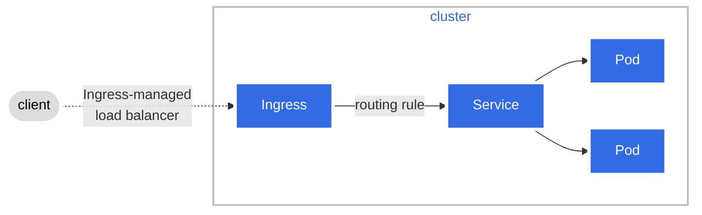

### Taint, Toleration
- 특정 노드가 Taint 옵션을 가지고 있으면 파드는 해당 노드에 생성 불가
- 파드가 Toleration 옵션을 가지고 있으면 해당 노드에 생성 가능
- NoSchedule: 스케줄러의 필터링 단계에서 노드가 배제
- preferNoSchedule: 스코어링 단계까지 넘어가고 다른 노드보다 낮은 점수를 갖음

### NodeSelector
- 레이블 정보에 따라 노드를 필터링 단계에서 배제
- Node Affinity로 확장

### Node Affinity
- 파드와 노드의 affinity label이 일치될 때 파드가 생성
- 4개의 옵션
  - requiredDuringSchedulingIgnoredDuringExecution   
    스케줄링 시 affinity label 반드시 일치해야 파드 생성   
    실행 중 파드와 노드의 affinity label 변경되어 불일치 시 파드 실행 불가
  - requiredDuringSchedulingPreferedDuringExecution   
    스케줄링 시 affinity label 반드시 일치해야 파드 생성   
    실행 중 조건 만족하지 않아도 파드 실행
  - preferedDuringSchedulingIgnoredDuringExecution   
    스케줄링 시 파드와 노드 옵션 맞지 않아도 파드 생성 가능   
    실행 중 파드와 노드의 affinity label 변경되어 불일치 시 파드 실행 불가
  - preferedDuringSchedulingPreferedDuringExecution   
    파드 스케줄링이나 파드 실행 중 affinity label이 일치하지 않아도 생성, 실행 가능

### Node Affinity vs Taint/Toleration
- Taint와 Toleration을 사용 시 Toleration 옵션이 있는 노드는 Taint옵션이 없는 노드에도 갈 수 있음
- Node Affinity와 Taint/Toleration을 같이 사용시 노드에 원하는 파드만 배치 가능

### Resources
- 1K = 1000 bytes, 1Ki = 1024 bytes
- 1M = 1000000 bytes, 1Mi = 2^20 bytes
- 파드가 할당 메모리보다 더 많이 소모하면 OOM(Out of memory) 에러가 발생
- 기본 설정은 제한 없음
- request:최소 limit: 최대
- LimitRange: Namespace 내의 파드 하나하나의 리소스량 설정
```yml {filename="limit-range-cpu.yaml"}
apiVersion: v1
kind: LimitRange
metadata:
  name: cpu-resource-constraint
spec:
  limits:
  - default:
      cpu: 500m         # limit
    defaultRequest:
      cpu: 500m         # request
    max:                # limit
      cpu: "1"
    min:
      cpu: 100m
    type: Container
```
- ResourceQuota: Namespace에 할당된 모든 파드 자원 통합해서 통제
```yml {filename="resource-quota.yaml"}
apiVersion: v1
kind: ResourceQuota
metadata:
  name: my-resource-quota
  namespace: nm-3
spec:
  hard:
    requests.cpu: 4
    requests.memory: 4Gi
    limits.cpu: 10
    limits.memory: 10Gi
```

### Health Check

### AntiAffinity, InterAffinity

## Networking
### Namespace와 CNI Plugins 생성 과정
- 네임스페이스: 네임스페이스 안에서는 네임스페이스 밖의 네트워크 인식 못함
- 리눅스에서 네임스페이스 확인   
  `ip netns`
- 네트워크 인터페이스 확인   
  `ip link`   
- `ip netns exec red ip link`
- 네임스페이스 두개 연결
  - 네트워크 인터페이스 두개 연결   
    `ip link add veth-red type veth peer name veth-blue`
  - 인터페이스를 네임스페이스에 결합   
    `ip link set veth-red netns red`   
    `ip link set veth-blue netns blue`
  - IP주소 부여   
    `ip -n red addr add 192.168.15.1 dev veth-red`   
    `ip -n blue addr add 192.1688.15.2 dev veth-blue`
  - 링크
    `ip -n red link set veth-red up`   
    `ip -n blue link set veth-blue up`
  - 확인
    `ip netns exec red ping 192.168.15.2`   
    `ip netns exec red arp`   
    `ip netns exec blue arp`   
    `arp`
- 네임스페이스를 연결하기 위한 가상 스위치 생성
  - 인터페이스 생성   
    `ip link add v-net-0 type bridge`   
    `ip link`   
    `ip link set dev v-net-0 up`
- 가상 스위치에 네임스페이스를 연결하기 위해 기존 링크 삭제   
  `ip -n red link del veth-red`
- 가상 스위치 인터페이스에 IP를 부여
- localhost를 게이트웨이로 설정하며 NAT masquerading을 사용해 출발지 주소를 host주소로 변경
- 이러한 과정을 재사용 가능하게 모아 프로그램으로 만든 것이 플러그인
- 이러한 플러그인들의 표준 규약과 프로토콜이 CNI
- 도커는 자체 CNI 사용
- 쿠버네티스는 컨테이너를 생성하는 컴포넌트 container runtime(containerd, cri-o)가 플러그인 설정
  - 플러그인 목록은 /opt/cni/bin에 있음
  - 쿠버네티스는 /etc/cni/net.d 에서 찾아서 결정
    - net.d 디렉터리에 다양하 파일이 있으면 알파벳 순으로 결정
    - /etc/cni/net.d/10-bridge.conf 파일에 파드의 서브넷 대역 등이 설정

### kubeproxy와 userspace, iptables, IPVS
- userspace -> iptables -> IPVS
- iptables

### Service Networking
- 서비스 생성하면 클러스터가 IP 부여, IP부여 범위는 api-server의 service-cluster-ip-range에 기재되 있음
```
ps aus | grep kube-api-server
```
- `iptables -L -t nat | grep db-service`명령 사용하면 서비스와 매핑된 파드 보임

### DNS
- name resolution: /etc/hosts 에 ip와 이름 매핑하는 것
- 각각의 호스트마다 /etc/hosts에 파일 저장하게 되면 hosts 개수가 늘어나면 불편-> DNS 서버로 해결
- /etc/resolv.conf 파일에 DNS서버 이름과 IP주소 명시
  - 8.8.8.8은 facebook과 같은 유명한 사이트 가지고 있는 DNS 서버
- /etc/hosts에 없으면 DNS서버로 가서 찾음
  - /etc/nsswitch.conf에서 순서를 변경 가능
- EX: www.google.com
  - . : Root
  - .com : Top Level Domain Name
  - google
  - Subdomain : mail, drive, www, maps, apps
  - mail.google.com, drive.google.com
  - Org DNS -> Root DNS -> .com DNS -> Google DNS -> Org DNS에 IP 캐싱
- 레코드 타입
  - A: 이름과 IPv4 매핑
  - AAAA: 이름과 IPv6 매핑
  - CNAME: 이름과 별명 매핑
- `nslookup` 명령
  - `nslookup www.google.com` 하면 ip주소와 google의 dns서버 주소 알 수 있음, etc/hosts는 제외
  - `dig www.google.com`

### DNS in K8s
```
서비스
Hostname    Namespace Type Root           IP Address
web-service apps      svc  cluster.local  10.107.37.188

=> curl http://web-service.apps.svc.cluster.local 로 접속 가능

파드
Hostname    Namespace Type Root           IP Address
10-244-2-5  apps      pod  cluster.local  10.107.37.188

=> curl http://10-244-2-5.apps.pod.cluster.local 로 접속 가능
```

### CoreDNS in K8s
`/etc/coredns/Corefile`
- CoreDNS 파드와 kube-dns 서비스로 구성

### Ingress

- Deployment 마다 로드밸런서를 생성해 연결하면 비용 증가 -> Ingress 사용
- Ingress: L7 Loadbalancer
- Ingress Controller: built-in 이 아님
  - nginx, Istio, HAProxy, GCE
```yaml {filename="nginx-ingress-controller.yaml"}
apiVersion: apps/v1
kind: Deployment
metadata:
  name: nginx-ingress-controller
spec:
  replicas: 3
  selector:
    matchLabels:
      name: nginx-ingress
  template:
    metadata:
      labels:
        name: nginx-ingress
    spec:
      containers:
        - name: nginx-ingress-controller
          image: quay.io/kubernetes-ingress-controller/nginx-ingress-controller:0.21.0
        
        args:
          - /nginx-ingress-controller
          - --configmap=$(POD_NAMESPACE)/nginx-configuration
        env:
          - name: POD_NAME
            valueFrom:
              fieldRef:
                fieldPath: metadata.name
          - name: POD_NAMESPACE
            valueFrom:
              fieldRef:
                fieldPath: metadata.namespace
        ports:
          - name: http
            containerPort: 80
          - name: https
            containerPort: 443
---
kind: ConfigMap
apiVersion: v1
metadata:
  name: nginx-configuration
```
```yaml {filename="nodeport.yaml"}
apiVersion: v1
kind: Service
metadata:
  name: nginx-ingress
spec:
  type: NodePort
  ports:
  - port: 80
    targetPort: 80
    protocol: TCP
    name: http
  - port: 443
    targetPort: 443
    protocol: TCP
    name: https
  selector:
    name: nginx-ingress
---
apiVersion: v1
kind: ServiceAccount
metadata:
  name: nginx-ingress-serviceaccount
```
- Ingress Resource
  - 1개 Rule과 2개 Paths
```yml {filename="Ingress-wear.yaml"}
apiVersion: networking.k8s.io/v1
kind: Ingress
metadata:
  name: ingress-wear
spec:
  rules:
  - http:
      paths:
      - path: /wear
        pathType: Prefix
        backend:
          service:
            name: wear-service
            port:
              number: 80
      - path: /watch
        pathType: Prefix
        backend:
          service:
            name: wear-service
            port:
              number: 80
```
  - 2개 Rule 각각 1개 Paths
```yml {filename="Ingress-wear.yaml"}
apiVersion: extensions/v1beta1
kind: Ingress
metadata:
  name: ingress-wear-watch
spec:
  rules:
  - host: wear.my-online-store.com
    http:
      paths:
        backend:
          service:
            name: watch-service
            port:
              number: 80
  - host: watch.my-online-store.com
    http:
      paths:
        backend:
          service:
            name: watch-service
            port:
              number: 80
```
