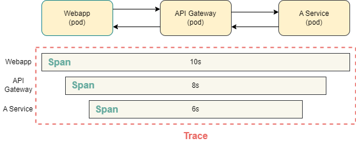

###  Kiali란
- Kubernetes SVC 간의 요청을 시각적으로 볼 수 있게 해주는 툴
- Kiali를 이용해 실시간으로 애플리케이션 변경 가능
  - VirtualServices 사용해 DDos 공격시 특정 노드의 트래픽을 차단 가능
  - Kiali의 svc 우클릭 > Actions > weighted routing 클릭 시 yaml 파일 자동 생성
    ```bash
    kubectl get vs
    kubectl get virtualservices

    kubectl get destinationrules
    ```
- Istio를 활용한 다양한 기능
  - Canary Release
  - A/B Testing
  - 프로덕션 클러스터에 Test Deploy 가능

### Open Tracing
- Vendor Neutral Tracing API
- jaeger와 zipkin

### Jaeger
- Uber가 개발
- istio 내장 tracing tool

### Zipkin
- twitter가 개발
- istio 내장 tracing tool

## Jaeger
- Kiali는 유용하지만 개별 요청의 디테일한 정보는 알 수 없음
- 개별 요청에 대한 정보를 보기 위해 Jaeger를 사용
- Upstream Request : Webapp(pod) -> API Gateway(pod) -> Staff Service(pod)
- Downstream Response: Webap <- API Gateway <- Staff Service

### traces와 span
- 요청이 시스템에 있는 여러 마이크로서비스를 통과하는 과정을 추적한 것
- 각각의 개별 타이밍 요소를 span이라고 함

- web app의 span이 10s: 요청을 보내고 돌려받을 때 까지 걸린 시간을 의미
- 같은 이름의 span이 두개가 보이는 것은 컨테이너의 요청과 프록시의 요청을 전부 추적하기 때문
  - 하나는 컨테이너의 요청과 응답 span이고 하나는 proxy의 요청과 응답을 추적한 것

### xrequest 헤더 확산
- xrequest 헤더를 확산하지 않으면 하나의 span에 대해 여러 trace가 만들어질 수 있음

### 출처
https://kdeon.tistory.com/122
https://www.udemy.com/course/kubernetes-istio-hands-on/learn/lecture/31482912?start=45#content