### Consumer Group
- 사용이유
  - fail over: 특정 컨슈머에 문제가 생기는 경우 동일 그룹 내의 다른 컨슈머가 계속해서 파티션에서 데이터를 읽을 수 있음
    - 컨슈머 1에 장애가 발생하더라도, 동일 컨슈머 그룹 내의 2,3,4 컨슈머가 계속해서 읽을 수 있도록 리밸런싱이 된다. 카프카는 컨슈머 그룹 단위로 offset을 관리하기 때문
  - 컨슈머 그룹 단위로 offset 관리
    - A컨슈머 그룹과 B컨슈머 그룹이 같은 파티션 구독하더라도 offset 각각 관리
- 하나의 컨슈머 그룹 내에서 컨슈머의 수는 파티션 수를 초과할 수 없음
  - 컨슈머와 파티션은 1대1 매칭 되어 병렬 처리됨
- 커밋(Commit)을 통해 자신이 레코드를 어디까지 가져갔는지 카프카 브로커에 기록

### 중복 메시지 처리
- Consumed Offset (Current Offset): 컨슈머가 메시지를 어디까지 읽었는가를 나타낸다. 해당 오프셋을 통해 컨슈머가 읽어야 할 다음의 메시지 위치를 식별할 수 있다. 해당 오프셋은 컨슈머가 poll( )을 받을 때마다 자동으로 업데이트 된다. 해당 오프셋은 각각의 컨슈머가 관리
- Committed Offset : 컨슈머가 메시지를 읽고 카프카에게 ‘여기까지의 오프셋을 처리했다’ 는 것을 알리는 Offset Commit 을 통해 업데이트되는 오프셋이다. 컨슈머의 프로세스가 실패하고 다시 시작되면 컨슈머가 다시 메시지를 읽게 될 시작점이 되는 오프셋이기도 하다. 해당 오프셋은 __consumer_offsets 라고 하는 카프카의 내부 토픽에서 관리

### 트랜잭셔널 메시징(Transactional Messaging)
- 서비스 로직의 실행과 그 이후의 이벤트 발행을 원자적으로(atomically) 함께 실행하는 것
- 2가지
  - 트랜잭셔널 아웃박스 패턴 (Transactional Outbox Pattern)
  - 변경 데이터 캡쳐 (Change Data Capture)

### 리밸런싱 문제
- 한 컨슈머에서 다른 컨슈머로 소유권이 이전
