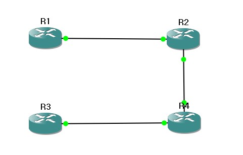

### ACL
- 네트워크에서 네트워크로 오고가는 트래픽을 검사하고 필터링하는 방법이 필요
- 데이터 네트워크에서는 라우터 트래픽 연결점 역할 수행
- 라우터에서 Access Control List를 사용해서 트래픽 식별, 필터링, 분류, 변환 작업을 수행
- 라우터의 ACL은 자신의 네트워크로 적절한 접속은 허용하면 원치 않는 연결은 거부할 수 있는 방법
- ACL을 이용하면 라우터의 지정된 인터페이스에 패킷의 통과를 허용하거나 거부 할 수 있음
- IP ACL은 허용 조건이나 거부 조건을 순차적으로 나열한 것으로 이들 조건을 IP주소나 상위 계층의 프로토콜에 적용
- ACL은 라우터를 통과하여 지나가는 트래픽은 필터링하지만 출발하는 트래픽은 필터링하지 않음
- 대부분 패킷 필터링이 목적이지만 특정한 트래픽을 구별해서 분류하는 용도로도 사용이 가능
- ACL동작
  - 허용 또는 거부 동작은 입력 ACL과 출력 ACL로 구분
  - 입력 ACL은 패킷들이 라우팅 되기 전에 처리
  - 출력 ACL은 라우팅 된 후에 패킷을 처리
  - 입력 ACL이 효율적, 라우터의 오버헤드를 줄일 수 있기 때문
  - 입력 ACL의 경우 필터링 조건을 확인해서 패킷의 허용 여부를 결정하고 패킷이 허용되면 라우팅 과정으로 넘어가는데 라우팅 테이블을 참조해서 라우팅이 가능한지 여부를 결정하고 불가능할 경우에는 패킷을 폐기
  - 출력 ACL의 경우는 입력된 패킷이 출력 인터페이스로 라우팅 된 후에 패킷의 허용여부를 결정
- 동일한 ACL을 하나의 라우터에 여러 개 설정하는 것이 가능
- ACL의 종류
- Standard ACL
  - 패킷의 발신지 IP 주소를 검사해서 패킷을 필터링
  - 10.1.1.1로 부터 출발한 패킷은 허용하고 10.1.1.2로부터 출발한 패킷은 거부하는 형태로 작성
  - 발신지 주소에 따라 프로토콜 전체를 허용 또는 거부하는 형식
- Extended ACL
  - 패킷의 발신지와 목적지를 모두 검사
  - 10.1.1.1 로부터 출발해서 10.1.1.3으로 가는 패킷은 거부하고 10.1.1.2로 가는 패킷은 허용
  - 특정 프로토콜, 포트 번호 등 다른 매개변수들도 검사할 수 있음
  - HTTP패킷은 허용하고 텔넷 패킷은 거부할 수 있음
- ACL을 구분하기 위한 방법은 번호를 붙여서 식별할 수 있고 이름을 붙여서 식별할 수 있음
  - 앞의 방법을 numbered ACL이라고 하고 뒤의 방법을 named ACL이라고 함
  - numbered ACL은 번호에 따라 Standard인지 Extended인지 구분할 수 있음
  - Standard는 1~99, 1300~1999 Extended는 100~199, 2000~2699
- 와일드카드 마스크
  - 여러 개의 IP주소를 하나로 표현하기 위한 방법
  - 4개의 옥텟으로 32비트 수
  - 마스크 비트 0은 대응하는 비트 값을 검사하라는 의미이고 1은 무시하라는 의미
  - 서브넷 마스크에서 0과 1은 대응하는 IP주소의 호스트 부분과 네트워크 부분을 결정하지만 와일드카드 마스크에서 0과 1은 대응하는 IP 주소가 일치해야 하는지 무시해도 되는지를 결정
  - 192.168.1.1 192.168.1.2 192.168.1.3이라는 3개의 IP가 존재하는 경우 이를 와일드카드 마스크로 표현을 하면 맨 뒤의 8비트만 확인하면 00000001, 000000010, 00000011임 => 와일드카드 마스크로는 00000011
  - 위의 주소는 192.168.1.0 0.0.0.3이 됨
  - 서브넷 마스크로는 192.168.0.0 255.255.255.0 => 192.168.0.0 0.0.0.255

### 설정
- Standard ACL의 설정
  - IP헤더에서 출발지 IP주소를 기반으로 패킷을 필터링
  - 번호는 1~99 또는 1300~1999 번을 이용
  - 단계
    - ACL구문 작성: `access-list 번호 {permit | deny | remark}`
      - `access-list 1 permit 172.16.0.0 0.0.255.255`
    - ACL 구문을 인터페이스에 적용: `ip access-group 번호 {in | out}`
      - `ip access-group 1 out`
  - ACL의 기본은 deny all
  - 특정 네트워크의 트래픽만 허용
  ```
  router#configure terminal
  router(config)#access-list 1 permit 12.16.0.0 0.0.255.255
  router(config)#interface fa0/1
  router(config-if)#ip access-group 1 out
  ```
  - 특정 네트워크의 트래픽만 거부
  ```
  router#configure terminal
  router(config)#access-list 2 deny 12.10.0.0 0.0.255.255
  router(config)#access-list 2 permit 0.0.0.0 255.255.255.255
  router(config)#interface fa0/1
  router(config-if)#ip access-group 2 out
  ```

## Standard ACL 적용 실습

- 4개의 라우터를 배치하고 서로 연결한 후 IP를 설정하고 서로 간의 네트워크가 전부 가능하도록 라우팅
- R1라우터에서 수행 (fa0/0이 R2라우터 fa0/1연결되어 있으면 fa0/1은 비어있음)
```
R1#configure terminal
R1(config)#interface fa0/1
R1(config-if)#ip address 192.168.0.1 255.255.255.0
R1(config-if)#no shutdown

R1(config-if)#interface fa0/0
R1(config-if)#ip address 192.169.0.1 255.255.255.0
R1(config-if)#no shutdown

R1(config-if)#router rip
R1(config-router)#version 2
R1(config-router)#network 192.168.0.0
R1(config-router)#network 192.169.0.0

R1(config-router)#exit
R1(config)#exit
R1#show ip interface brief
R1#show ip route
```
- R2라우터에서 수행(fa0/0이 R3라우터 fa0/1연결되어 있고 fa0/1이 R1라우터 fa0/0과 연결)
```
R2#configure terminal
R2(config)#interface fa0/1
R2(config-if)#ip address 192.169.0.254 255.255.255.0
R2(config-if)#no shutdown

R2(config-if)#interface fa0/0
R2(config-if)#ip address 192.170.0.1 255.255.255.0
R2(config-if)#no shutdown

R2(config-if)#router rip
R2(config-router)#version 2
R2(config-router)#network 192.170.0.0
R2(config-router)#network 192.169.0.0

R2(config-router)#exit
R2(config)#exit
R2#show ip interface brief
R2#show ip route
```
- R3라우터에서 수행(fa0/1이 R4라우터 fa0/0과 연결되어 있으며 fa0/0은 비어 있음)
```
R3#configure terminal
R3(config)#interface fa0/1
R3(config-if)#ip address 192.173.0.1 255.255.255.0
R3(config-if)#no shutdown

R3(config-if)#interface fa0/0
R3(config-if)#ip address 192.172.0.1 255.255.255.0
R3(config-if)#no shutdown

R3(config-if)#router rip
R3(config-router)#version 2
R3(config-router)#network 192.172.0.0
R3(config-router)#network 192.173.0.0

R3(config-router)#exit
R3(config)#exit
R3#show ip interface brief
R3#show ip route
```
- R4라우터에서 수행(fa0/1이 R2라우터 fa0/1과 연결되어 있으며 fa0/0은 R3라우터 fa0/1과 연결되어 있음)
```
R4#configure terminal
R4(config)#interface fa0/1
R4(config-if)#ip address 192.169.0.254 255.255.255.0
R4(config-if)#no shutdown

R4(config-if)#interface fa0/0
R4(config-if)#ip address 192.173.0.254 255.255.255.0
R4(config-if)#no shutdown

R4(config-if)#router rip
R4(config-router)#version 2
R4(config-router)#network 192.169.0.0
R4(config-router)#network 192.173.0.0

R4(config-router)#exit
R4(config)#exit
R4#show ip interface brief
R4#show ip route
```
- 라우터에서 ping을 보낼 때 ping이라고 입력하고 엔터치면 여러 옵션을 설정해서 ping이 가능
- R2에서 192.168.0.0 255.255.255.0만 허용 가능하도록 fa0/1에 in으로 적용
```
R2#configure terminal
R2(config)#access-list 1 permit 192.168.0.0 0.0.0.255
R2(config)#interface fa0/1
R2(config-if)#ip access-group 1 in
```
- R1 라우터에서 ping을 전송하는데 한 번은 192.168.0.1을 가지고 전송해보고 한 번은 192.169.0.1을 가지고 전송
- 앞의 경우는 permit이라서 허용되지만 뒤의 경우는 deny라서 UUUUU로 보임
```
R1#ping
Protocol [ip]: ip
Target IP address: 192.170.0.1
Repeat count [5]:
Datagram size [100]:
Timeout in seconds [2]:
Extended commands [n]: yes
Source address or interface: 192.169.0.1
Type of service [0]:
Set DF bit in IP header? [no]:
Validate reply data? [no]:
Data pattern [0xABCD]:
Loose, Strict, Record, Timestamp, Verbose[none]:
Sweep range of sizes [n]:
Type escape sequence to abort.
Sending 5, 100-byte ICMP Echos to 192.170.0.1, timeout is 2 seconds:
Packet sent with a source address of 192.169.0.1
UUUUU
Success rate is 0 percent (0/5)
```
- R2의 ACL 적용 해제
```
R2(config)#no access-list 1
```
- R2에서 192.169.0.0 255.255.255.0만 거부하도록 fa0/1에 in 으로 잘못 적용
```
R2#configure terminal
R2(config)#access-list 2 deny 192.169.0.0 0.0.0.255
R2(config)#interface fa0/1
R2(config-if)#ip access-group 2 in
```
- 위의 예에서 R1라우터에서 ping을 전송하는데 한번은 192.168.0.1을 가지고 전송해보고 한번은 192.169.0.1을 가지고 전송하면 ACL을 잘못 만들었기 때문에 무조건 deny가 됨. 특정 네트워크를 거부할 때는 반드시 ACL의 마지막에 permit 0.0.0.0 255.255.255.255를 추가해주어야 함
```
R2(config)#access-list 2 deny 192.169.0.0 0.0.0.255
R2(config)#interface fa0/1
R2(config-if)#ip access-group 2 in
R2(config-if)#exit
R2(config)#access-list 2 permit 0.0.0.0 255.255.255.255
R2(config)#exit
```

### Extended ACL(확장 ACL)
- Standard ACL에 비해서 더 넓은 범위의 제어와 유연성을 가지고 있음
- Standard ACL은 출발지 주소를 기반으로 전체 프로토콜에 대해서만 허용과 거부를 할 수 있음
- 출발지 주소와 목적지 주소IP를 모두 검사하고 프로토콜 유형, 포트 주소 등을 이용해서 접속을 거부하거나 허용할 수 있음
- HTTP는 허용하고 FTP는 거부할 수 있음
  - ACL번호를 100~199 또는 2000~2699를 사용
- 명령어 형식
  - `access-list 번호 {permit | deny} 프로토콜 출발지주소 와일드카드마스크 [연산자 포트번호] 목적지주소 와일드카드마스크 [연산자 포트번호]`
  - 172.16.4.0/24에서 출발해서 172.16.3.0/24로 가는 TCP 21번 호트를 사용하는 FTP-control 패킷을 차단
    `access-list 101 deny tcp 172.16.4.0 0.0.0.255 172.16.3.0 0.0.0.255 eq 21`
- ACL을 적용할 때는 출발지 근처에서 설정하는 것을 권장
  - 불필요하게 트래픽이 이동하는 것을 줄이기 위해서
- 특정 네트워크 대역을 거부하고자 할 때는 마지막에 `permit ip any any`를 추가해 주어야 함
- Extended ACL을 적용하는 경우는 라우터 뒤에 여러 종류의 서버가 존재하는 경우
- 172.16.4.0/24에서 출발해서 172.16.3.0/24로 가는 TCP Telnet 포트(23) FTP-control 패킷을 차단
```
access-list 102 deny tcp 172.16.4.0 0.0.0.255 172.16.3.0 0.0.0.255 eq 23
access-list 102 permit ip any any
```
- 172.16.4.0/24에서 나가는 모든 Telnet을 차단
```
access-list 103 deny tcp 172.16.4.0 0.0.0.255 any eq 23
access-list 103 permit ip any any
```

### Named ACL
- CISCO 장비에서는 이름을 이용한 ACL 작성을 지원
- 번호를 이용한 ACL은 줄 단위 수정이 안되서 수정을 하는 경우 ACL을 삭제하고 다시 작성해야 함
- Standard Named ACL
  ```
  (config)#ip access-list standard 이름
  (config-std-nacl)#구분번호 {deny | permit} {출발지주소 와일드카드마스크 | any}
  (config-if)#ip access-group 잉름 {in | out}
  ```
- 라우터 2개 통신이 되도록 설정
```
R1#configure terminal
R1(config)#interface fa0/1
R1(config-if)#ip address 192.168.0.1 255.255.255.0
R1(config-if)#no shutdown

R1(config-if)#interface fa0/0
R1(config-if)#ip address 192.169.0.1 255.255.255.0
R1(config-if)#no shutdown

R1(config-if)#router rip
R1(config-router)#version 2
R1(config-router)#network 192.168.0.0
R1(config-router)#network 192.169.0.0

R1(config-router)#exit
R1(config)#exit
R1#show ip interface brief
R1#show ip route
```
- R2라우터에서 수행(fa0/1이 R1라우터 fa0/0와 연결)
```
R2#configure terminal
R2(config)#interface fa0/1
R2(config-if)#ip address 192.169.0.254 255.255.255.0
R2(config-if)#no shutdown

R2(config-if)#interface fa0/0
R2(config-if)#ip address 192.170.0.1 255.255.255.0
R2(config-if)#no shutdown

R2(config-if)#router rip
R2(config-router)#version 2
R2(config-router)#network 192.170.0.0
R2(config-router)#network 192.169.0.0

R2(config-router)#exit
R2(config)#exit
R2#show ip interface brief
R2#show ip route
```
- 연결 확인
  - 양쪽 라우터에서 show ip route 했을 때 나한테 없는 하나의 네트워크 대역이 R표시와 함께 보이는지 확인
  - R1라우터에서 ping 명령을 수행, 타겟은 192.170.0.1이고 소스는 192.168.0.1과 192.169.0.1
  - R2라우터에서 ping 명령 수행, 타겟은 192.168.0.1이고 소스는 192.170.0.1과 192.169.0.254
  - named ACL을 사용하는 이유
    - 번호보다는 이름이 기억하기가 쉬움
    - ACL은 작성한 순서대로 적용이 되고 작성을 하면 마지막에 deny any가 추가
    - 번호를 이용한 ACL은 한번 작성을 하고 수정을 할 때 맨 뒤에 추가밖에 안됨
  - named ACL을 이용해서 R2라우터의 fa0/1에서 192.168.0.0/24에서 들어오는 트래픽 차단하기
```
R2#configure terminal
R2(config)#ip access-list standard issuemaker
R2(config-std-nacl)#15 deny 192.168.0.0 0.0.0.255
R2(config-std-nacl)#20 permit any
R2(config-std-nacl)#interface fa0/1
R2(config-if)#ip access-group issuemaker in
```
- R1라우터에서 192.170.0.1로 192.169.0.1과 192.168.0.1에서 ping을 전송
- 192.168.0.1의 경우는 UUUUU가 보임
- 192.169.0.1의 경우는 !!!!!가 보임

```
트래픽 차단
R(ACL)---------Firewall(ACL보다 다양한 방식으로 차단)------Switch(VLAN)---------HOST(iptables)
```

