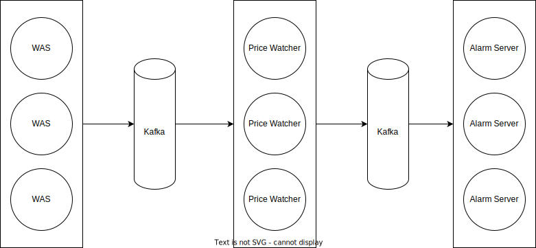

WAS -> 가격 감시 프로그램 -> 카프카 -> 컨슈머, 알림 서버
가격 감시 알고리즘:
- X: 웹 소켓으로 코인 전체 감시, 가격 감시 리스트를 주기적으로 확인 -> 일치하면 가격 삭제 -> 리스트 동기화 : 굳이 필요 없음 비동기 함수 실행될 때마다 리스트 중복됨
- O: 사용자 지정 가격 비동기 함수로 바로 받아서 감시 -> 일치시 함수 종료
  - DB에 따로 저장 -> 어차피 메모리에서 실행 -> 레디스 필요성 감소