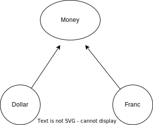

## Test
### 단위 테스트, 통합 테스트, 인수 테스트
- 단위테스트: 함수형 프로그래밍 언어는 함수를, 객체 지향 프로그래밍 언어는 객체를 테스트 하는 것. 블랙박스 테스트와 화이트박스 테스트가 있음
- 통합테스트: 모듈이나 애플리케이션을 테스트, 스트레스 테스트
- 인수테스트: 개발 환경에서 운영환경으로 이전을 할 때 테스트를 하는 것. 최근에는 운영환경에서 개발을 하게 되면 이 과정은 생략됨. 쿠버네티스와 도커 환경에서 개발하기 때문.

### Black Box Test & White Box Test
- Black Box Test: 기능을 테스트
- White Box Test: 내부 알고리즘 테스트. 에일리언 코드(유지보수가 어려운 코드)나 스파게티 코드(중복코드)를 제거해 나가는 것.
---
### 알파 테스트 & 베타 테스트
- 클라이언트의 입장에서 테스트 하는 것. 요구 사항과 맞게 구현이 되었는지.
- 알파테스트: 개발자의 환경에서 사용자가 테스트 하는 것
- 요즘은 자주 하지 않음
- 베타테스트는 다양한 클라이언트의 환경에서 테스트 하는 것

### 폭포수 모형
- 전체를 설계하고 구현하고 테스트하고 인수하는 것
- 설계에서 시간을 많이 소모하기 때문에 폭포수 -> 나선형 -> 애자일로 변화
- 피드백이 없는 것이 단점
- 큰 프로젝트에는 맞지 않음

### 나선형 모형
- 기능을 30%정도 구현하고 위험 분석을 먼저 하는 것
- 폭포수 모형에 피드백을 추가한 것

### 애자일 + TDD + DDD
핵심이 되는 기능을 빠르게 개발하고 나머지를 갖다 붙이는 것   
문서화와 주석 다는 데 시간이 오래 걸리므로 로그를 찍는 것을 추천. 운영과 개발을 같이 하기 떄문.   
운영자가 볼 것은 log.info, 개발자가 볼 것은 log.debug   
유지 보수가 매우 잦음

### 정적 코드 테스트
읽기 좋고 이해하기 쉬운 코드를 만드는 것. 스네이크 표기법, 헝가리안 표기법 등이 있음.

### 해두면 좋은 것(통합테스트)
- health check: curl 명령을 주기적으로 보내기
  - 쿠버네티스의 liveness, 프로메테우스에서의 블랙박스 exporter
- 스트레스 테스트: curl 명령을 한 번에 많이 보내기

## TDD
- 소프트웨어 개발 방법론 중 하나
- 기존의 테스트 코드 작성은 프로덕션 코드를 작성한 이후에 이루어졌지만 TDD를 적용하면 프로덕션 코드보다 실패하는 코드를 먼저 작성하고 코드를 테스트를 통과하기 위해 최소한으로 개선한 후 테스트를 통과한 코드를 프로덕션 코드로 리팩토링
- **테스트를 위한 기술이 아니라 소프트웨어 설계 방법론에 가까움**(배민이 사용)

### TDD Cycle
- RED
  - 동작하는 프로덕션 코드가 없는 상황에서 테스트 코드를 먼저 작성하는 것
  - 요구 사항을 작성하는 것 과 유사
- GREEN
  - 테스트를 통과하는 최소한의 코드를 작성하는 과정
  - 명백한 실제 구현을 입력하는 방법도 있지만 최대한 빨리 GREEN을 보기 위해서는 상수를 반환하는 코드를 만들고 점진적으로 변수로 바꾸어 바꾸어나가는 방법도 있음
- REFACTOR
  - GREEN을 만들기 위해서 작성한 코드를 수습
  - 좋은 코드로 변경해나가는 과정

### 필요한 이유
- 변화에 대한 불안감 해소
- 한번에 하나의 일만 집중
- 빠른 피드백
- 테스트 코드 자체가 문서화
- 테스트를 나중에 작성하는 것은 귀찮은 작업
- 테스트 코드를 작성하게 되면 의존성이 높은 코드는 테스트가 어렵기 때문에 모듈간 결합도가 낮고 응집도를 높일 수 있는 코드를 사용

## Test에 의해 주도되는 전형적 모델
### TDD의 리듬
- 테스트를 하나 추가
- 모든 테스트를 실행하고 새로 추가한 것이 실패하는지 확인
- 코드를 변경
- 모든 테스트를 실행하고 전부 성공하는지 확인
- 리팩토링: 중복을 제거하고 나쁜 코드를 좋은 코드로 변경

### 달러를 받아서 현재 환율을 적용해서 변경된 금액을 확인
- 테스트 코드를 작성: 문법적 오류로 인해서 컴파일이 안됨
```java {filename="TestClass.java"}
public class TestClass {
    @Test
    public void testMultiplication() {
        Dollar five = new Dollar(5);
        five.times(2);
        assertEquals(10, five.amount);
    }
}
```
- 에러를 발생시킨 요인
  - Dollar 클래스가 없음
  - 매개변수를 받는 생성자가 없음
  - times 메서드가 없음
  - amount 필드가 없음
- 문법적인 에러를 해결하기
```java {filename="Dollar.java"}
public class Dollar {
    int amount;
    public Dollar(int amount) {

    }
    public void times(int multiplier) {

    }
}
```
- 테스트를 통과하기 위한 코드로 변경(상수를 사용했다가 변수로 전부 치환)
```java {filename="Dollar.java"}
public class Dollar {
    int amount;
    public Dollar(int amount) {
        this.amount = amount;

    }
    public void times(int multiplier) {
        amount *= multiplier;
    }
}
```

### 타락한 객체
- 일반적인 TDD 주기
  - 테스트를 작성
  - 테스트 코드가 동작하도록 작성
  - 리팩토링
- **작동하는 코드를 만들고 깔끔한 코드를 만드는 것에 유의**
- 깔끔한 코드를 만들고 작동하도록 해결해나가면 Architecture-Driven Development(아키텍쳐 주도 개발)

- 불변의 객체
  - 객체는 동일한 연산을 수행하면 항상 동일한 결과를 나타내는 것이 좋습니다.
  - 객체의 동작을 예측할 수 있기 때문입니다.
  - 동일한 연산을 여러 번 수행했을 때 동일한 결과를 만들어 내는 성질을 멱등성이라고 합니다.
  - 연산을 수행하고 나면 호출한 객체를 변경하는 것 보다는 새로운 결과를 갖는 객체를 생성해서 리턴해주는 것이 좋습니다.
  - 이런 방식으로 작업을 하게되면 이전으로 돌아가는 것도 수월해집니다.
  - 단점은 매번 새로운 객체를 만들어서 가지고 있기 때문에 연산을 여러 번 하면 메모리 부담을 증가시키게 되므로 여기에 대비한 방법도 생각을 해두어야 합니다.
  - 쿠버네티스에서는 이전 객체를 변경하는 StatefulSet 과 새로운 객체를 만들어서 제공하는 Stateless(Deployment, ReplicaSet, ReplicaController, Pod) 한 객체를 만들어주는 방법 모두 제공하고 있으며 Python의 DataFrame의 경우에도 데이터를 조작하는 함수들은 inplace 옵션을 이용해서 현재 객체를 변경할 것인지 여부를 설정할 수 있도록 하고 있습니다.
```java
{
    String str = new String("Hello");
    System.out.println(str);
}
```
{} 블럭이 끝날 때 까지 str이 메모리 정리가 되지 않음
```java
System.out.println(new String("Hello"));
```
위와 같이 str 객체를 만들지 않으면 메모리가 바로 정리됨

### 멱등성
어떤 객체가 동일한 연산을 여러 번 수행해도 결과는 항상 동일해야 함. 예시로 http의 PUT은 멱등성이 있고 PATCH는 없음

### 객체의 비교
- 객체의 필드를 호출해서 객체를 값 처럼 사용하는 패턴을 Value Object Pattern이라고 합니다.
- Value Object Pattern에서는 필드가 생성자를 통해서 일단 설정한 후에는 결코 변하지 않아야 합니다.
- Value Object Pattern에서는 한 번 만들어지면 절대로 데이터가 변경되지 않게 됩니다.
- Value Object Pattern에서는 모든 연산(메서드 또는 함수)이 새로운 객체를 반환해야 합니다.
- Value Object Pattern에서는 비교를 위해서 필드를 직접 호출하지 말고 비교를 위한 메서드나 함수를 만들어 사용하는 것을 권장   
  필드는 private으로 만들고 equals같은 메서드를 생성해서 사용
- 자바에서는 Dollar를 해시 테이블의 키로 사용할 것이라면 equals를 구현할 때 hashCode 메서드도 구현하는 것을 권장합니다.
- 실습
  - 테스트 클래스 수정
```java {filename="TestClass.java"}
public class TestClass {
   @Test
   public void testMultiplication(){
       Dollar five = new Dollar(5);
       Dollar dollar = five.times(2);
       //assertEquals(10, dollar.amount);

       dollar = five.times(2);
       //assertEquals(10, dollar.amount);
   }

   @Test
   public void testEquality(){
       assertTrue(new Dollar(5).equals(new Dollar(5)));
   }
}
```
  - 값 객체를 위한 클래스 수정
```java {filename="Dollar.java"}
public class Dollar {
   private int amount;

   public Dollar(int amount){
       this.amount = amount;
   }

   public Dollar times(int multiplier){
       return new Dollar(amount * multiplier);
   }

   public boolean equals(Object o){
       //amount 값이 같으면 같은 걸로 간주
       return this.amount == ((Dollar)o).amount;
   }
}
```

  - 테스트 클래스 내용 수정
```java {filename="TestClass.java"}
import org.junit.jupiter.api.Test;

import static org.junit.jupiter.api.Assertions.assertEquals;
import static org.junit.jupiter.api.Assertions.assertTrue;

public class TestClass {
   @Test
   public void testMultiplication(){
       Dollar five = new Dollar(5);
       assertEquals(new Dollar(10), five.times(2));
       assertEquals(new Dollar(15), five.times(3));
   }
}
```

### 유사한 작업을 하는 Franc 클래스를 이용한 동일한 테스트
- 테스트하는 메서드를 추가
```java {filename="TestClass.java"}
@Test
public void testFrancMultiplication(){
   Franc five = new Franc(5);
   assertEquals(new Franc(10), five.times(2));
   assertEquals(new Franc(15), five.times(3));
}
```
- 테스트 코드가 물리적 오류를 일으키기 때문에 실행이 안되므로 물리적 오류를 없애는 작업을 수행
```java {filename="Franc.java"}
public class Franc {
   private int amount;

   public Franc(int amount){
       this.amount = amount;
   }

   public Franc times(int multiplier){
       return new Franc(amount * multiplier);
   }

   public boolean equals(Object o){
       //amount 값이 같으면 같은 걸로 간주
       return this.amount == ((Franc)o).amount;
   }
}
```
- 코드를 리팩토링

### Inheritance(상속)
- 이전 과정에서 Dollar 와 유사한 역할을 하는 Franc 라는 클래스를 사용했는데 이 클래스가 Dollar 와 유사했기 때문에 코드를 복사해서 사용했습니다.   
완전히 동일하지는 않기 때문에 코드를 찾아가면서 수정을 했습니다.
- 테스트 과정에서 상속을 이용한 중복 코드 제거
  - 거의 유사한 작업을 하는 2개의 클래스를 하나의 클래스로부터 상속받도록 상위 클래스를 생성
  - 2개의 클래스에서 동일하게 존재하는 속성을 상위 클래스로 이동
  - 동일한 알고리즘을 사용하는 메서드를 상위 클래스에 작성
  - 리팩토링 과정에서는 이미 동작하는 테스트 코드는 그대로 두고 테스트 코드에 사용하는 클래스나 메서드 그리고 클래스들 사이의 관계를 수정해서 좋은 코드를 만들어 나감
- 수정한 결과
  - Test 클래스
```java {filename="TestClass.java"}
import static org.junit.jupiter.api.Assertions.assertEquals;

public class TestClass {
   @Test
   public void testMultiplication(){
       Dollar five = new Dollar(5);
       assertEquals(new Dollar(10), five.times(2));
       assertEquals(new Dollar(15), five.times(3));
   }

   @Test
   public void testFrancMultiplication(){
       Franc five = new Franc(5);
       assertEquals(new Franc(10), five.times(2));
       assertEquals(new Franc(15), five.times(3));
   }
}
```
  - 상위 클래스에 해당하는 Money 클래스
```java {filename="Money.java"}
public class Money {
   protected int amount;

   public boolean equals(Object o){
       //amount 값이 같으면 같은 걸로 간주
       return this.amount == ((Money)o).amount;
   }
}
```
  - Dollar 클래스
```java {filename="Dollar.java"}
public class Dollar extends Money{

   public Dollar(int amount){
       this.amount = amount;
   }

   public Dollar times(int multiplier){
       return new Dollar(amount * multiplier);
   }
}
```
  - Franc 클래스
```java {filename="Franc.java"}
public class Franc extends Money{

   public Franc(int amount){
       this.amount = amount;
   }

   public Franc times(int multiplier){
       return new Franc(amount * multiplier);
   }
}
```
- 인터페이스는 구현 과정에서 만들어 지지만 상속은 기능 추가 과정에서 만들어짐
- 상속의 가장 큰 목적은 기능 추가

```
Type 변수명 = Type에 맞는 데이터 대입
변수명은 Type의 데이터만 호출 가능
오버라이딩된 메서드에 한해서는 대입된 인스턴스의 메서드 호출
```

### 사과와 오렌지 문제
- 이전 작업에서 중복된 부분을 많이 생략했지만 아래 코드를 테스트에 추가하면 이상한 결과가 도출됨
```java
@Test
public void testEquality(){
   assertTrue(new Dollar(5).equals(new Dollar(5)));
   assertFalse(new Dollar(5).equals(new Dollar(6)));
   assertTrue(new Franc(5).equals(new Franc(5)));
   assertFalse(new Franc(5).equals(new Franc(6)));
   //서로 다른 타입의 데이터는 비교 대상이 아닙니다.
   //이런 경우는 에러가 발생하거나 false가 리턴되어야 하는데 amount 값이 같다는 이유로
   //비교가 가능하고 동일하다고 리턴됩니다.
   assertTrue(new Dollar(5).equals(new Franc(5)));

}
```
  - 마지막 5번째 비교에서 서로 다른 클래스 타입으로 만들어진 인스턴스간의 비교가 가능
  - 이 문제 해결을 위해서는 비교를 할 때 타입을 확인해서 타입이 동일한 경우에만 값을 비교하도록 해주어야 함
  - 자바에서는 getClass()라는 메서드를 호출하면 자신의 타입을 리턴함
- Money 클래스를 수정
```java {filename="Money.java"}
public class Money {
   protected int amount;

   public boolean equals(Object o){
       //amount 값이 같으면 같은 걸로 간주
       Money money = (Money)o;
       //값만 비교하지 않고 자료형도 비교
       return getClass().equals(money.getClass()) && this.amount == money.amount ;
   }
}
```
  - 다시 실행하면 마지막 다섯번째 줄이 false로 테스트에 실패

### 추상을 이용해서 테스트 할 때 하위 클래스 이름없이 테스트
- 테스트 코드에서는 하위 클래스의 변경에 관심을 가질 필요가 없음
- 테스트 클래스의 내용을 수정
```java {filename="TestClass.java"}
import org.junit.jupiter.api.Test;

import static org.junit.jupiter.api.Assertions.*;

public class TestClass {
   @Test
   public void testMultiplication(){
       //dollar 라는 메서드는 실제로는 Dollar 객체를 리턴하므로 five에 들어있는 객체는 Dollar 객체
       //times는 Money 클래스에 추상메서드로 존재하므로 문법적 에러가 없어지고
       //Dollar에서 오버라이딩을 했으므로 five가 호출할 때는 Dollar에 만든 메서드가 호출됩니다.
       Money five = Money.dollar(5);
       assertEquals(Money.dollar(10), five.times(2));
       assertEquals(Money.dollar(15), five.times(3));
   }

   @Test
   public void testFrancMultiplication(){
       Money five = Money.franc(5);
       assertEquals(Money.franc(10), five.times(2));
       assertEquals(Money.franc(15), five.times(3));
   }

   @Test
   public void testEquality(){
       assertTrue(Money.dollar(5).equals(Money.dollar(5)));
       assertFalse(Money.dollar(5).equals(Money.dollar(6)));
       assertTrue(Money.franc(5).equals(Money.franc(5)));
       assertFalse(Money.franc(5).equals(Money.franc(6)));
       //서로 다른 타입의 데이터는 비교 대상이 아닙니다.
       //이런 경우는 에러가 발생하거나 false가 리턴되어야 하는데 amount 값이 같다는 이유로
       //비교가 가능하고 동일하다고 리턴됩니다.
       assertFalse(Money.dollar(5).equals(Money.franc(5)));
   }
}
```
- 상위 클래스 내용 수정: 문법적인 오류만 수정
```java {filename="Money.java"}
public abstract class Money {
   protected int amount;

   static Dollar dollar(int amount){
       return new Dollar(amount);
   }

   static Franc franc(int amount){
       return new Franc(amount);
   }

   abstract Money times(int multiplier);

   public boolean equals(Object o){
       //amount 값이 같으면 같은 걸로 간주
       Money money = (Money)o;
       //값만 비교하지 않고 자료형도 비교
       return getClass().equals(money.getClass()) && this.amount == money.amount ;
   }
}
```
- 실제 동작하는 코드를 작성
  - Dollar 클래스를 수정
```java {filename="Dollar.java"}
public class Dollar extends Money{

   public Dollar(int amount){
       this.amount = amount;
   }

   public Money times(int multiplier){
       return new Dollar(amount * multiplier);
   }
}
```
- Franc 클래스 수정
```java {filename="Franc.java"}
public class Franc extends Money{

   public Franc(int amount){
       this.amount = amount;
   }

   public Money times(int multiplier){
       return new Franc(amount * multiplier);
   }
}
```

- 구현 내용
  - 동일한 모양의 메서드의 선언부를 통일시켜서 중복 제거를 위해서 전진
  - 메서드 구현부는 어쩔 수 없지만 선언부를 통일시켜서 앞으로 추가될 기능에 템플릿을 제공
  - 팩토리 메서드를 만들어서 테스트 코드에서 콘크리트 하위 클래스의 존재 사실을 분리해냄

### 기능 추가
- 추상 클래스가 만들어져 있는 상황에서는 추상 클래스에 기능의 원형을 추가하고 실제 사용하는 콘크리트 클래스에 기능을 구현하는 방식으로 기능을 추가합니다.
- Dollar와 Franc 클래스에 통화 기호를 리턴하는 기능을 추가하고자 하는 경우
  - 테스트 메서드를 만들어서 실패하는 코드를 생성
```java {filename="TestClass.java"}
    @Test
    public void testCurrency(){ 
        assertEquals("USD", Money.dollar(1).currency());
        assertEquals("CHF", Money.franc(1).currency());
    }
```
  - 문법적으로 에러가 없는 코드를 생성
```java {filename="Money.java"}
    abstract String currency();
```
  - 기능 구현   
    Dollar 클래스에 메서드 구현
```java {filename="Dollar.java"}
    String currency() {
        return "USD";
    }
```
    Franc 클래스에 메서드 구현
```java {filename="Franc.java"}
    String currency() {
        return "CHF";
    }
```
- 생성자를 상위 클래스로 이동
```java {filename="TestClass.java"}
public abstract class Money {
   protected int amount;
   protected  String currency;

   Money(int amount, String currency) {
       this.amount = amount;
       this.currency = currency;
   }

   static Dollar dollar(int amount){
       return new Dollar(amount, "USD");
   }

   static Franc franc(int amount){
       return new Franc(amount, "CHW");
   }

   String currency() {
       return currency;
   }

   abstract Money times(int multiplier);

   public boolean equals(Object o){
       //amount 값이 같으면 같은 걸로 간주
       Money money = (Money)o;
       //값만 비교하지 않고 자료형도 비교
       return getClass().equals(money.getClass()) && this.amount == money.amount ;
   }
}
```

- Dollar 클래스 수정 및 중복제거
```java {filename="Dollar.java"}
public class Dollar extends Money{
   public Dollar(int amount, String currency) {
       super(amount, currency);
   }

   public Money times(int multiplier){
       return Money.dollar(amount * multiplier);
   }
}
```
- Franc 클래스 수정 및 중복제거
```java {filename="Franc.java"}
public class Franc extends Money{
   public Franc(int amount, String currency) {
       super(amount, currency);
   }

   public Money times(int multiplier){
       return Money.franc(amount * multiplier);
   }
}
```
- times 메서드도 상위 클래스로 이전
  - Money 클래스 수정
```java {filename="TestClass.java"}
public  class Money {
   protected int amount;
   protected  String currency;

   Money(int amount, String currency) {
       this.amount = amount;
       this.currency = currency;
   }

   static Dollar dollar(int amount){
       return new Dollar(amount, "USD");
   }

   static Franc franc(int amount){
       return new Franc(amount, "CHF");
   }

   public Money times(int multiplier){
       return new Money(amount * multiplier, currency);
   }

   String currency() {
       return currency;
   }

   public boolean equals(Object o){
       //amount 값이 같으면 같은 걸로 간주
       Money money = (Money)o;
       //값만 비교하지 않고 자료형도 비교
       return currency.equals(money.currency()) && this.amount == money.amount ;
   }
}
```
  - Dollar 클래스 수정
```java {filename="Dollar.java"}
public class Dollar extends Money{
   public Dollar(int amount, String currency) {
       super(amount, currency);
   }
}
```
  - Franc 클래스
```java {filename="Franc.java"}
public class Franc extends Money{
   public Franc(int amount, String currency) {
       super(amount, currency);
   }
}
```
- **기존 클래스의 변경이나 메서드의 변경이 테스트 코드에 영향을 주지 않고 수정되어야 함**
- **기존 테스트 코드가 정상 동작하면서 새로운 테스트를 추가해 나가야 함**
- 리팩토링 과정에서는 기존의 테스트 코드가 에러가 발생하거나 수정되어야 하면 안됨
- 이런 과정은 단위 테스트 과정에서 대부분 이루어짐
- Java에서는 이러한 과정을 JUnit을 이용해서 수행함

### 불필요한 클래스 제거
- Money 클래스를 수정
```java {filename="TestClass.java"}
public  class Money {
   protected int amount;
   protected  String currency;

   Money(int amount, String currency) {
       this.amount = amount;
       this.currency = currency;
   }

   static Money dollar(int amount){
       return new Money(amount, "USD");
   }

   static Money franc(int amount){
       return new Money(amount, "CHF");
   }

   public Money times(int multiplier){
       return new Money(amount * multiplier, currency);
   }

   String currency() {
       return currency;
   }

   public boolean equals(Object o){
       //amount 값이 같으면 같은 걸로 간주
       Money money = (Money)o;
       //값만 비교하지 않고 자료형도 비교
       return currency.equals(money.currency()) && this.amount == money.amount;
   }
}
```
- 테스트 코드를 수행해서 에러가 없는지 확인
- Dollar와 Franc 클래스를 제거
- 테스트 코드를 수행해서 에러가 없는지 확인

### 기능 추가
- Money 객체끼리 더하는 기능을 추가하고자 함   
  객체끼리 연산을 수행하고자 하는 경우 파이썬이나 C++ 등은 연산자 오버로딩을 이용하고 자바는 메서드를 구현해서 구현함
- 과정
  - 테스트 코드에 실패하는 모양을 생성
```java {filename="TestClass.java"}
@Test
public void testAddition(){
   Money sum = Money.dollar(5).plus(Money.dollar(10));
   assertEquals(Money.dollar(15), sum);
}
```
  - 에러가 없는 코드를 생성
```java {filename="Money.java"}
public Money plus(Money money){
   return new Money(15, currency);
}
```
  - 내용을 구현
```java {filename="Money.java"}
public Money plus(Money money){
   return new Money(amount + money.amount, currency);
}
```

### 이 과정이 적용되는 곳
- Service 계층의 단위 테스트를 할 때 이 과정이 적용
- Repository 계층의 단위 테스트는 SQL을 호출해서 그 결과를 만들어내는 코드만 존재하기 때문에 단위 테스트를 수행할 때 작업의 결과만 확인
  - 만들어진 메서드를 호출하는 경우가 대부분이라서 코드 리팩토링은 거의 존재하지 않음
  - SQL 튜닝 정도를 하게 됨
- Controller 계층에서도 단위 테스트를 수행만하지 코드 리팩토링은 거의 없음
  - 이 계층은 사용자의 요청을 받아서 필요한 서비스를 호출하고 그 결과를 제공하는 형태로 만들어지기 때문에 알고리즘 적용이 거의 없기 때문
- Controller 계층이나 Repository 계층은 정적 코드 분석과 단위 테스트 수행 여부 정도만 확인