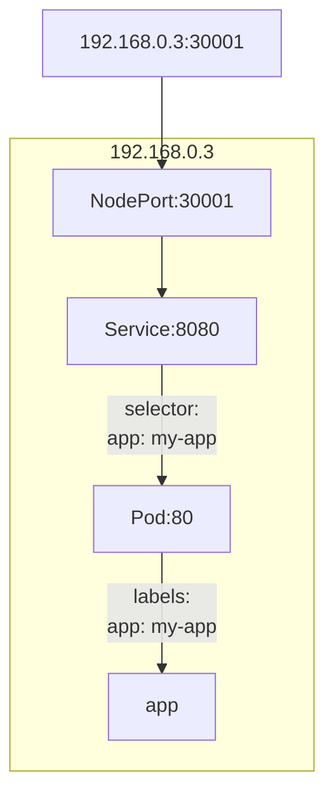
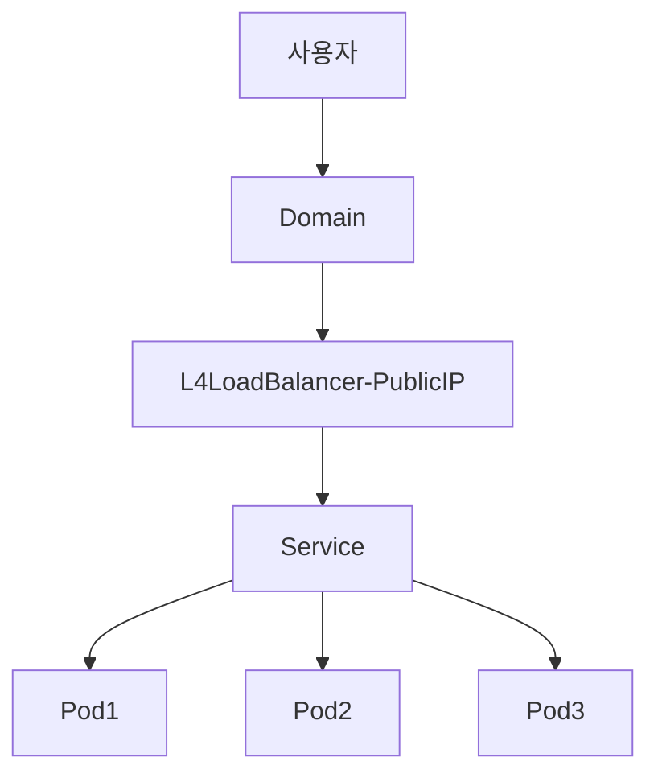
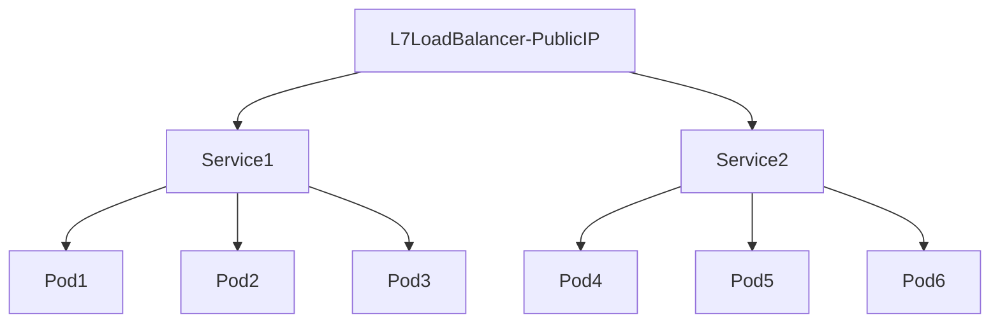

## 파드를 외부로 노출
- 파드는 동적으로 생성(파드의 IP는 고정이 아니고 유동)
IP가 유동이 되면 외부에서 접근하기가 어려움
- 파드를 외부에서 접근할 수 있도록 해주는 것이 서비스
서비스를 사용하면 파드가 클러스터 내 어디에 있든지 마치 고정된 IP로 접근할 수 있도록 해줌

### 서비스 타입
- 클러스터 내부 접속 용도: ClusterIP
- 클러스터 외부 접속 용도: NodePort, LoadBalancer, Ingress, ExternalName
- ExternalName은 외부와 내부 통신이 가능하도록 하기는 하지만 실제로는 내부에서 외부를 접근할 때 사용하는 용도

### ClusterIP
- 기본 서비스 타입
- 서비스를 파드에 연결해 놓으면 서비스IP를 이용해서 파드에 접근
- 서비스에서 사용할 pod를 생성할 Deployment를 생성
  - nginx 이미지를 이용하고 nginx는 80번 포트 사용하며 2개를 생성
  - ClusterIP.yml 파일을 생성하고 작성
```yml {filename="CluserIP.yml"}
apiVersion: apps/v1 # pod create: apps/v1, job create: batch/v1, etc: v1

kind: Deployment

metadata:
  name: clusterip-nginx

spec:
  selector:
    matchLabels:
      run: clusterip-nginx
  replicas: 2

  template: # 컨테이너 생성
    metadata:
      labels:
        run: clusterip-nginx
    spec:
      containers:
      - name: clusterip-nginx
        image: nginx
        ports:
        - containerPort: 80
```
- 파드생성 `kubectl apply -f ClusterIP.yml`
- 파드 확인
```
kubectl get pods

kubectl get pods -o wide

#특정 레이블을 가진 파드를 확인
kubectl get pod -l 레이블앞부분=레이블뒷부분 -o wide

kubectl get pod -l run=clusterip-nginx -o wide
```
- 동일한 노드에 속하는 파드끼리는 기본적으로 이름이나 IP를 이용해서 통신이 가능하지만 파드의 이름과 IP는 동적으로 변경됨
- 서비스를 만드는 방법
  - 메니페스트를 이용해서 생성하는 방법
  - `kubectl expose` 명령어를 사용하는 방법

- 명령어를 이용해서 서비스를 생성
```
kubectl expose deployment/clusterip-nginx
```
- 서비스 정보 확인
```
kubectl get svc

kubectl describe svc 서비스이름
```
- Cluster IP 와 EndPoint 가 출력되는데 Cluster IP는 다른 파드가 접근하기 위한 IP이고 EndPoint 실제 Pod의 IP<br>
이들을 매핑하는 방법은 Service의 spec.selector 에 파드의 레이블을 기재하면 매핑이 됨<br>
Service를 매니페스트로 만들어서 Deployment 연결을 하고자 하면
```
spec:
 type: ClusterIP
 selector:
  run: clusterip-nginx
 ports:
  - name: 이름
    targetPort: Pod내부 포트
    port: 클러스터에서 사용할 포트
    nodePort: 클러스터 외부에서 사용할 포트(30000 ~ 32767)
```
- 클러스터 내에 다른 Pod를 만들어서 확인
  ```
  kubectl run busybox --rm -it --image=busybox /bin/sh
  ```
  - 만들어진 pod 내의 bash에서 `wget 서비스IP` 를 이용해서 index.html 파일이 다운로드 되는지 확인
- 오브젝트 생성 명령
  - `kubectl run`이나 `expose`: 생성형
  - `kubectl create`: 명령형
  - `kubectl apply`: 선언형
  - 컨테이너가 원하는 대로 동작하는지 확인을 할 때는 생성형을 이용
  -  생성형은 오브젝트 생성 및 변경에 대한 히스토리를 저장하기 때문에 과거의 변경 내역을 확인할 수 없다는 단점이 있음
  - 생성형은 개발 과정에서 많이 사용하며 선언형과 명령은 오브젝트의 버전 관리가 중요할 때 사용
  - 명령형은 하나의 yaml이나 json 파일을 이용해서 오브젝트를 생성해야 하며 생성된 파일을 통해 히스토리를 추적할 수 있음
  - 선언형은 annotation에 정보가 저장되어 자동으로 히스토리를 관리하는 것이 가능하지만 선언형에서는 create 나 replace를 사용하지 못함
  - annotation: 오브젝트에 메타데이터를 할당할 수 있는 주석과 같은 개념
    - 레이블과 같이 키-값 구조를 갖지만 기능 측면에서 차이가 발생
    - 레이블은 셀렉터를 이용해서 검색과 식별을 할 수 있지만 annotation 입력은 가능해도 검색은 안됨
    - 쿠버네티스 클러스터의 API Server가 annotation에 지정된 메타데이터를 참조해 동작하기 때문에 주석보다는 의미가 더 있음
    - annotation에 기재하는 내용: 빌드, 릴리즈, 도커 이미지에 대한 정보, 로깅 정보나 모니터링 정보, 디버깅에 필요한 정보(이름, 버전, 빌드 정보), 관리자 연락처, 사용자 지시 사항
    - 리소스 그룹을 지정해야 할 때는 레이블을 사용하지만 쿠버네티스 외부에서 정보를 사용(helm)할 때는 annotation을 이용
- 서비스를 만들 때 ClusterIP를 별도로 지정하지 않으면 ClusterIP가 없는 서비스가 만들어지는데 이런 서비스를 Headless Service라고 하는데 Headless Service를 로드밸런싱이나 서비스IP가 필요 없을 때 생성
- headless service에 selector를 설정하면 API를 통해서 접근할 수 있는 End Point가 만들어지지만 selector가 없으면 End Point가 만들어지지 않음

### External Name
- External Name은 클러스터 내부에서 외부의 엔드 포인트에 접속하기 위한 서비스
  - 엔드포인트는 대부분 클러스터 외부에 위치하는 데이터베이스나 애플리케이션API
  - 외부 자원을 사용할 때 직접적인 이름이나 URL 등을 사용하게 되면 이름이나 URL이 변경되면 코드를 수정해야 하는 일이 발생
  - 설정 파일에 이름을 하나 만들어서 그 이름과 실제 URL 또는 IP를 연결시켜 두면 나중에 외부 자원의 위치나 이름이 변경되었을 때 소스 코드를 수정하지 않고 설정 파일의 연결 부분만 수정해서 새로 배포하면 되기 때문에 변경에 유리
- External Name 사용 방법
```yml
apiVersion: v1
kind: Service
metadata:
  name: external-service
spec:
  type: ExternalName
  externalName: myservice.test.com
```
  - external-service 라는 요청을 내부에서 하면 실제로는 myservice.test.com에 요청을 하게 됨
  - FQDN(Fully Qualified Domain Name - 절대 도메인 또는 전체 도메인 네임): myservice.test.com
  - CNAME(별칭): external-service
- 별명을 사용하는 이유는 크게 2가지인데 하나는 줄여쓰기 위해서이고 다른 하나는 외부의 자원의 이름이 변경되었을 때 소스 코드를 수정하지 않고 사용하기 위해서

### NodePort

- 모든 워커 노드에 특정 포트를 열고 여기로 들어오는 모든 요청을 노드포트 서비스로 전달하기 위한 방법
- 노드포트 서비스를 요청을 받으면 해당 요청을 처리할 수 있는 파드로 요청을 전달
- 외부 사용자는 워커노드의 IP에 노드포트를 추가해 접속을 할 수 있음
- 워커 노드의 IP가 192.169.1.3이고 노트포트를 30001이라고 가정하면 192.169.1.3:30001로 접속하면 됨
- 노드포트는 30000 ~ 32767로 제한되어 있음
- yaml 파일에 노드포트 서비스를 하나 만들고 외부에서 어떤 포트로 접속할 지를 지정하는데 파드는 셀렉터로 지정하면 됨
- 노드포트 사용하기
  - 파드를 생성할 deployment를 위한 yaml 파일 생성: nginx-deployment.yml
```yml {filename="nginx-deployment.yml"}
apiVersion: apps/v1 #pod create: apps/v1, job create: batch/v1, etc: v1

kind: Deployment

metadata:
  name: nginx-deployment
  labels:
    app: nginx

spec:
  selector:
    matchLabels:
      app: nginx
  replicas: 3

  template:
    metadata:
      labels:
        app: nginx
    spec:
      containers:
      - name: nginx
        image: nginx
        ports:
        - containerPort: 80
```
  - 파드 생성
  ```
  kubectl apply -f nginx-deployment.yml
  ```
  - NodePort를 개방하는 서비스 파일을 생성: nginx-svc.yml
```yml {filename="nginx-svc.yml"}
apiVersion: v1

kind: Service

metadata:
  name: my-nginx
  labels:
    run: my-nginx

spec:
  type: NodePort		#NodePort 설정
  ports:
  - port: 8080 		    #NodePort Service에서 사용하는 포트
    targetPort: 80 		#Pod(Container)에서 사용하는 Port
    protocol: TCP
    name: http
  selector:
    app: nginx		    #app: nginx라는 레이블을 갖는 파드를 서비스
```
  - 서비스 생성
    ```
    kubectl apply -f nginx-svc.yml
    ```
  - 서비스 확인: 외부에서는 10.43.37.241:30844로 접근
```bash
$ kubectl get svc
NAME              TYPE        CLUSTER-IP      EXTERNAL-IP   PORT(S)          AGE
my-nginx          NodePort    10.43.37.241    <none>        8080:30844/TCP   28s
```
- NodePort의 제약 사항
  - 포트 당 하나의 서비스만 사용할 수 있음
  - 30000 ~ 32767 까지의 포트만 사용 가능
  - 노드나 가상 머신의 IP주소가 바뀌면 다시 반영을 해야 함

### LoadBalancer
- LoadBalancer는 서버에 가해지는 부하를 분산해주는 장치 또는 기술
- 사용자가 하나의 파드에 집중해 접근하게 되면 그 파드는 부하를 견디지 못하고 비정상적으로 종료될 수 있기 때문에 이러한 현상이 발생하지 않도록 부하를 고루 분산하기 위해 사용하는 것이 로드밸런서
- L4 LoadBalancer
  - OSI 7계층 중에서 네트워크(IP, IPX) 이나 트랜스포트(TCP, UDP)의 정보를 바탕으로 로드를 분산
  - IP 주소나 포트 번호 등을 이용해서 트래픽을 분산한느 것이 L4 LoadBalancer
  - 쿠버네티스의 로드밸런서는 L4 로드 밸런서
- L7 LoadBalancer
  - OSI 7계층 중 애플리케이션 계층(HTTP, FTP, SMTP)을 기반으로 로드를 분산
  - URL, HTTP Header, Cookie 등과 같은 사용자의 요청을 기준으로 트래픽을 분산
  - 쿠버네티스에서 L7 LoadBalancer의 기능은 Ingress(외부에서 클러스터 내의 서비스에 접속할 수 있도록 만든 규칙을 정의하는 객체)를 이용해서 구현하게 되는데 Ingress는 서비스의 유형에 포함되지 않지만 외부에서 파드에 접속할 때 부하 분산 용도로 사용
- L4 로드 밸런서 사용
  - L4 Switch를 사용하는 로드밸런서로 외부에서 접근할 수 있는 IP를 이용해서 로드밸런서를 구성
  - 외부 IP(public IP)를 로드밸런서로 설정하면 클러스터 외부에서 접근이 가능
  - 파드 생성: label 이 app: httpd 로 생성
  ```
  kubectl create deployment httpd --image=httpd
  ```
  - 서비스 파일
```yml {filename="httpd-service.yml"}
apiVersion: v1
kind: Service
metadata:
  name: httpd-service
spec:
  selector:
    app: httpd
  ports:
    - name: http
      protocol: TCP
      port: 80
      targetPort: 80
  externalIPs:
    - 10.0.2.15 #public IP
```
  - 서비스 생성 `kubectl apply -f httpd-service.yml`
  - 외부에서는 10.0.2.15:80을 요청하면 됨





### Ingress
- LoadBalancer와 동일한 역할을 수행
- LoadBalancer는 IP를 이용해서 부하를 분산하지만 Ingress는 URL을 이용해서 부하 분산이 가능
- Ingress Controller는 쿠버네티스에서 제공하지 않음
- nginx Ingress Controller를 별도로 설치해서 사용
- 작업 방법
  - 하나의 파드 생성(coffee) <-> coffee-sv 서비스 생성
  - 하나의 파드 생성(tea) <-> tea-svc 서비스 생성
- /tea라는 요청이 오면 tea-svc로 보내고 /coffee라는 요청이 오면 coffee-svc로 요청을 전송하는 Ingress Service 파일을 생성
```yml
apiVersion: networking.k8s.io/v1
kind: Ingress
metadata:
 name: cafe-ingress
 annotations:
  kubernetes.io/ingress.class: nginx
spec:
 rules:
 - http:
    paths:
    - path: /tea
      pathType: Prefix
      backend:
       service:
       name: tea-svc
       port:
        number: 80
    - path: /coffee
      pathType: Prefix
      backend:
       service:
       name: coffee-svc
       port:
        number: 80
```