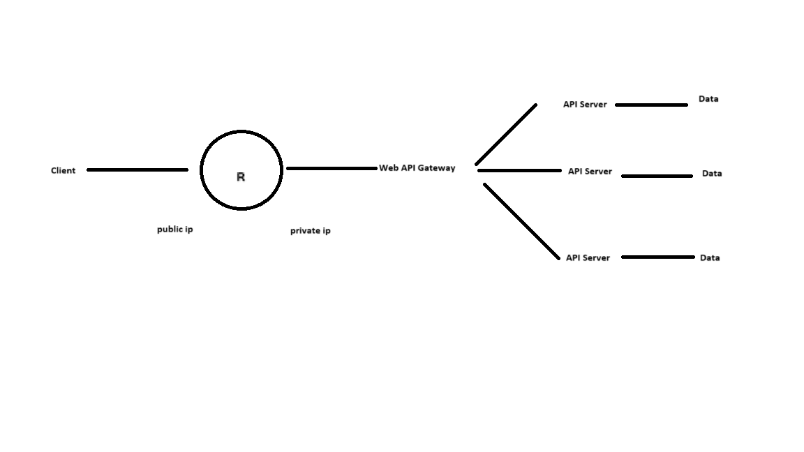

### 사용하게 된 목적
- IPv4의 주소 부족 문제 해결
- NAT의 경우는 보안의 측면
- Transparaent(투명성): 사용자는 몰라도 된다
- 위치 투명성: 사용자는 위치를 몰라도 됨, 위치를 아는 것은 보안에서는 위험

### VLSM
- Variable Length Subnet Mask: 하나 이상의 classful 네트워크 내에서 두 개 이상의 서브넷 마스크를 사용할 수 있도록 하는 것
- IP주소 공간을 어떻게 할당하고 사용하는지에 따라 실제 네트워크에 많은 이점을 제공
- 적은 주소를 필요로 하는 서브넷의 경우 네트워크 관리자가 더 적은 호스트 비트를 갖는 마스크를 사용해서 서브넷팅 해주면 됨
- VLAN과 주소를 적절히 서브넷팅 하는 것은 거의 비슷한 효과를 만들 수 있음
  - 라우터를 나누는 것은 물리적으로 네트워크 분할, VLAN은 스위치를 논리적으로 분할, 서브넷팅도 유사한데 서브넷 마스크를 이용해서 네트워크를 분리하면 내부 통신이 불가능해짐(255.255.255.255)
  - 하나의 네트워크에서 2개 이상의 서브넷 마스크를 이용하는 것
    - 하나의 라우터에 연결된 네트워크의 대역이 172.16.0.0/16인데 이를 내부에서 172.16.14.0/24로 다시 분할하고 이를 다시 /27로 분할해서 사용하는 형태태

### NAT와 PAT(중요)
- IPv4의 주소가 고갈되는 문제를 해결하기 위해서 먼저 등장한 것은 Classless 할당인데 낭비되는 주소를 줄일 수는 있었지만 근본적인 해결책이 되지는 못함
- 주소 고갈 문제를 해결하기 위해서 IPv5가 나왔는데 표준화 시작 단계에서 폐기됨
- IPv4에서 IPv6로 넘어갈 때 IPv4의 수명을 연장시킨 기술 주으이 하나가 NAT
- 내부와 외부의 IP주소를 다르게 설정할 수 있도록 하는 기술
  - 일반적으로 내부에서는 Private IP를 사용하고 외부에서는 Public IP를 사용
  - 적은 수의 Public, Private IP Address를 Private IP Address를 이용해서 여러 호스트가 공유할 수 있도록 해주는 것
  - 라우터가 내부 주소를 외부 주소로 변환해서 다른 네트워크로 패킷을 전달할 수 있도록 해주는 것인데 이 때 전체 네트워크에 대해서 하나의 주소만 외부에 광고하도록 NAT를 설정할 수 있는데 이렇게 되면 내부의 주소를 광고하지 않기 때문에 네트워크 보안을 확보할 수 있음
  - inside address와 outside address
  - inside address: 내부 네트워크 내의 장비를 가리키는 주소
  - outside address: 외부 네트워크(인터넷) 내의 장비를 가리키는 주소
- local address와 global address
  - local address: 내부 데이터그램에서 사용하는 주소
  - global address: 외부 데이터그램에서 사용하는 주소
- 주소 매핑에 따른 NAT 분류
  - static NAT: 네트워크 관리자가 수동으로 내부 주소와 외부 주소를 일대일로 매핑하는 것
    - 내부 네트워크 장비가 외부 네트워크에 항상 동일한 외부 주소로 표현되어야 할 필요가 있는 경우에 사용
    - 수동으로 매핑 정보를 입력하고 관리해야 하고 내부 네트워크에서 IP주소를 공유할 수 없음
    - aws의 ec2에 탄력적 IP를 적용하는 것이 static NAT - 서버 가능
  - dynamic NAT: 내부 IP를 주소 풀에 있는 외부 IP로 자동으로 변환하는 것
    - 필요할 때 마다 즉시 생성되고 세션이 완료되면 변환 정보는 버려지고 내부 전역 주소를 다시 풀로 반환됨
    - 일반적인 서버 용도로는 사용할 수 없음
    -  Amazon의 EC2 서비스가 이런 구조
    -  EC2 서비스는 public IP를 가지고 이렇게 구현을 함
    -  서버로 사용 불가능
- PAT(Port Address Translation): 포트 번호를 달리해서 내부 호스트를 구분하는 것
  - 하나의 IP 주소를 가지고 여러 개의 다른 IP 주소를 매핑할 수 있음
  - NAT Overloading이라고 하기도 함
  - 포트 번호는 16비트이므로 이론적으로 65536개의 주소가 매핑 가능
- 과정
  - NAT를 수행하는 라우터는 패킷이 네부 내트워크를 떠날 때 패킷의 출발지 주소를 내부 전역 주소로 변환
  - 또한 외부 네트워크로부터 도착한 패킷의 목적지 IP를 다시 내부 지역 주소로 변환
### 정적 NAT 설정
  ```
  R(config)#ip nat inside source static local-ip global-ip
  R(config)#ip nat inside source static 10.1.1.2 192.168.1.2
  ```
  - 내부 인터페이스에 설정
    - `R(config)#ip nat inside`
  - 외부 인터페이스에 설정
    - `R(config-if)#ip nat outside`
### 정적 NAT 실습
  - 라우터 2개를 배치하고 fa0/0를 연결
  - VPCS를 1개 추가 배치하고 첫번째 라우터의 fa0/1과 연결
  - 첫번째 라우터 설정
  ```
  R1#configure terminal
  R1(config)#interface fa0/0
  R1(config-if)#ip address 192.168.1.1 255.255.255.0
  R1(config-if)#no shutdown
  R1(config-if)#interface fa0/1
  R1(config-if)#ip address 10.1.1.1 255.255.255.0
  R1(config-if)#no shutdown
  R1(config)#exit
  ```
  - 두번째 라우터 설정
  ```
  R2#configure terminal
  R2(config)#interface fa0/1
  R2(config-if)#ip address 192.168.1.254 255.255.255.0
  R2(config-if)#no shutdown
  R2(config-if)#exit
  R2(config)#
  R2#show ip interface brief
  ```
  - VPCS 설정
  ```
  PC1>ip 10.1.1.2 /24 10.1.1.1 -> ip와 게이트웨이 설정
  PC1>ping 10.1.1.1
  PC1>ping 192.168.1.254 -> 이 경우 실패
  ```
  - R1에서 정적 NAT 설정
  ```
  R1(config)#ip nat inside source static 10.1.1.2 192.168.1.2
  R1(config)#interface fa0/0
  R1(config-if)#ip nat outside
  R1(config-if)#interface fa0/1
  R1(config-if)#ip nat inside
  ```
  - PC1에서 수행
  ```
  PC1>ping 192.168.1.254 -> 성공
  ```
  - PC1에서 R2로 ping을 보내면 static NAT로 인해 10.1.1.2가 192.168.1.2로 변환되어 같은 네트워크 대역에 속하는 걸로 인지하게 되어 ping을 보낼 수 있음

  - CSP(클라우드 공급자 - Amazon, Google, MS 등) - Private Cloud(대기업 등)
  - MSP - CSP가 제공하는 인프라를 이용해서 기업에게 서비스를 제공(메가존 클라우드, 베스핀 글로벌 등)

### 동적 NAT
- 주소 부족 문제 때문에 수행
  - 주소 풀이 필요
  - 내부에 호스트 대수에 비해서 가지고 있는 IP가 적고 대신에 모든 내부 호스트가 동시에 인터넷을 사용하지 않는 경우 사용
  - 과정
    - 외부 주소 풀을 생성: `ip nat pool 이름 시작IP 종료IP`
    - 내부 주소 풀을 생성: `access-list 번호 permit 네트워크대역 와일드마스크`
    - NAT 활성화: `ip source list  ACL번호 pool 이름`
    - 인터페이스에서 inside와 outside 설정

### 동적 NAT 실습
- R1에서 기존 설정 제거
```
R1(config)#interface fa0/0
R1(config-if)#ip nat outside
R1(config-if)#interface fa0/1
R1(config-if)#ip nat inside
R1(config-if)#exit
R1(config)#no ip nat inside source static 10.1.1.2 192.168.1.2
R1(config)#interface fa0/1
R1(config-if)#no ip nat inside
R1(config-if)#interface fa0/0
R1(config-if)#no ip nat outside
```
- R1에서 설정
```
R1#configure terminal

외부에서 사용할 주소 풀을 생성
R1(config)#ip nat pool net-200 192.168.1.32 192.168.1.63 netmask 255.255.255.224

내부에서 사용할 주소 풀을 생성
R1(config)#access-list 1 permit 192.168.1.0 0.0.0.255

연결
R1(config)#ip nat inside source list 1 pool net-200

인터페이스 설정
R1(config)#interface fa0/0
R1(config-if)#ip nat outside
R1(config)#interface fa0/1
R1(config-if)#ip nat inside

VPC에서 다시 ping을 수행
PC1>ping 192.168.1.254
```

### PAT: 포트 변환
- 동적 NAT가 주소 부분 문제를 많이 해결하기는 했지만 완전하지는 않음
- IP 변환을 하지 않고 특정 포트를 매핑해서 외부로 나가는 것이 PAT
- IP 주소는 동일하고 포트번호만 다르기 때문에 NAT Overload라고도 함
- 2가지 방법으로 설정 가능
  - 하나는 동적 NAT와 동이랗게 설정하는데 `ip nat inside source list`명령 끝에 `overload`를 추가해서 설정
  - 라우터의 외부 인터페이스를 이용해서 설정 가능
%% Method Overloading: 객체 지향 언어에서 하나의 클래스에 메서드 이름은 같고 매개변수의 자료형이 개수가 다른 메서드가 존재하는 경우
이름 = 함수 이 형태의 언어는 Method Overloading이 없음
함수의 이름이 하나의 id를 소유하기 때문

### PAT 실습
```
R1#configure terminal

외부에서 사용할 주소 풀을 생성
R1(config)#ip nat pool net-100 192.168.1.96 192.168.1.127 netmask 255.255.255.224

내부에서 사용할 주소 풀을 생성
R1(config)#access-list 2 permit 10.1.1.0 0.0.0.255

연결
R1(config)#ip nat inside source list 2 pool net-100 overload

인터페이스 설정
R1(config)#interface fa0/0
R1(config-if)#ip nat outside
R1(config)#interface fa0/1
R1(config-if)#ip nat inside

VPC에서 다시 ping을 수행
PC1>ping 192.168.1.254

R1에서 주소변환 확인
R1#show ip nat translations
```

### PAT 실습: 외부 인터페이스의 IP1개를 가지고 PAT 설정
- 현재 상태: 라우터 2개와 VPCS1개
- VPCS는 R1의 fa0/1에 연결
- R1의 fa0/0와 R2의 fa0/0가 연결
- R1의 fa0/0은 192.168.1.1 255.255.255.0이 설정
- R1의 fa0/1은 10.1.1.1 255.255.255.0이 설정

- R2의 fa0/0은 192.168.1.254 255.255.255.0이 설정

- VCPS는 ip를 10.1.1.2 /24 10.1.1.1을 설정
- VCPS는 ip를 10.1.1.1로 ping을 하면 잘 나감
- VCPS에서 192.168.1.254로 ping을 전송하면 도달하지 못함
- ACL 작성
```
R1#configure terminal
R1(config)#access-list 3 permit 10.1.1.0 0.0.0.255

주소 Pool을 만들지 않고 바로 적용
R1(config)#ip nat inside source list 3 interface fa0/0 overload

inside와 outside 적용
인터페이스 설정
R1(config)#interface fa0/0
R1(config-if)#ip nat outside
R1(config)#interface fa0/1
R1(config-if)#ip nat inside
```
- `ip nat inside source list ACL 번호 interface 인터페이스이름 overload`
- inside와 outside 적용