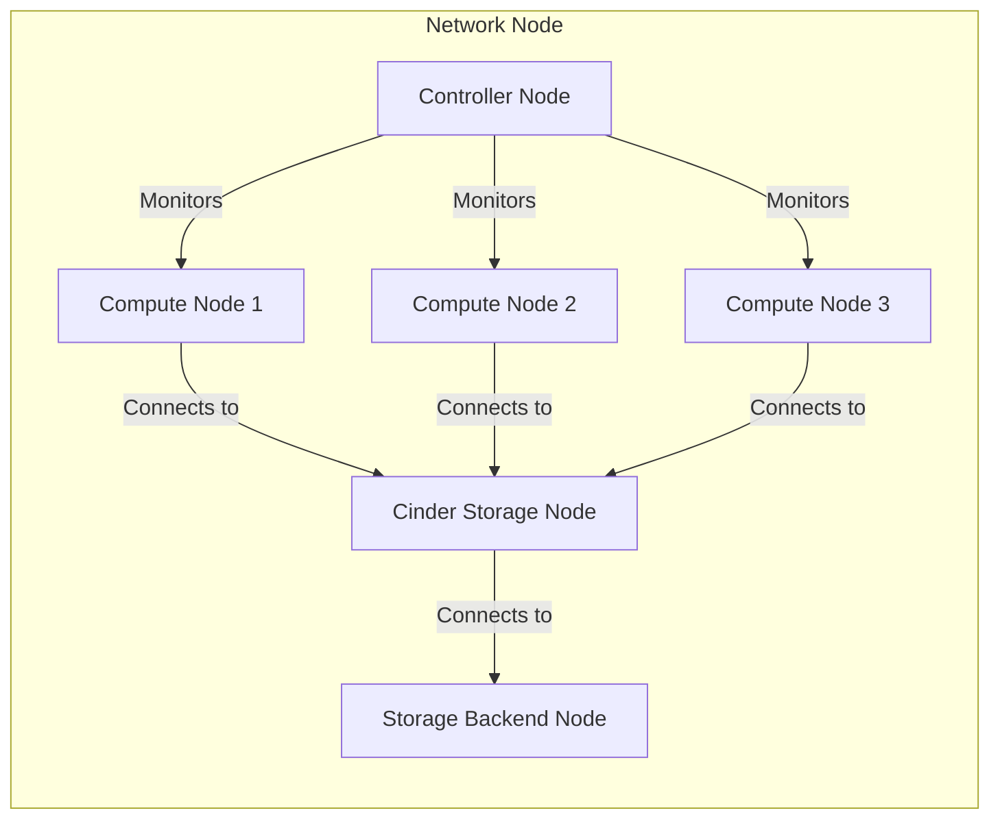

## 1. 클라우드 서비스 & 프라이빗 클라우드 서비스
- 최근에 기업들이 IT 서비스를 Public Cloud 서비스로 전환하는 경우가 많은데 타 기업 과의 자원 공유, IT 자원의 소유권 문제, 법규에 따른 문제, 제어권 주체 변경 등의 논쟁으로 인해 도입을 주저하기도 합니다.
- 이러한 논쟁 때문에 Private Cloud 도입을 검토

### 1)클라우드 컴퓨팅
- 인터넷 기술을 활용하여 확장 가능하고 탄력적인 IT 자원들을 서비스로 제공하는 컴퓨팅

### 2)클라우드 컴퓨팅 특징
- On Demand: 수요자 중심(수요자의 요구에 즉시 대응하는 서비스)
- Elasticity: 탄력성, Scale-Out, Auto-Scaling, SDN
- agility: 민첩성
  - 회복 민첩성
  - 비즈니스 민첩성
  - 서비스 민첩성
- SelfService: 별다른 기술 습득 없이 사용이 가능
- 사용량 기반 과금
- 확장성
- 이용률
- 비용 절감
- 신뢰성

### 3)클라우드 서비스 모델 과 배치 모델
- 서비스 모델
  - IaaS: Infrastructure
  - PaaS: Platform
  - SaaS: Service
  - DaaS: Desktop

- 배치 모델
  - Public Cloud: 이용 대상을 제한하지 않는 클라우드
  - Private Cloud: 이용 대상을 기업의 내부로 제한하는 클라우드
  - Community Cloud: 같은 관심사를 갖는 그룹에 제공하는 클라우드
  - Hybrid Cloud: Private Cloud와 Public Cloud를 혼용해서 제공하는 클라우드
  - Multi Cloud: 2개 이상의 Public Cloud를 사용하는 경우

### 4)용어
- 서비스 개념
  - 클라우드 컴퓨팅 서비스 또는 클라우드 서비스: 클라우드 컴퓨팅을 이용해서 사용자의 요청에 따라 IT자원을 배포, 측정, 관리, 운영하는 IT자원 제공 서비스
  - 클라우드 컴퓨팅: 하드웨어, 소프트웨어 등의 IT 자원을 논리적인 분할이나 결합을 통해서 인터넷을 통해 효율화시킨 컴퓨팅
  - 클라우드 컴퓨팅 기술: 퍼블릭이나 프라이빗 클라우드를 구축할 때 사용하는 하드웨어나 소프트웨어 기술
  - 클라우드 서비스 인프라: IaaS, PaaS, SaaS 서비스를 제공하기 위한 인프라
  - CSP(Cloud Service Provider): 클라우드 서비스를 제공하는 곳으로 AWS, MS Azure, GCP, Naver Cloud, KT Cloud 등
  - MSP(Managed Service Provider): CSP가 제공하는 클라우드 서비스를 고객 환경에 최적화된 구성으로 컨설팅 하는 곳으로 Megazone, 베스핀 글로벌, 클루커스가 대표적
- 플랫폼 관련 용어
  - 클라우드 플랫폼: 사용자의 요청에 따라 클라우드 서비스를 제공하는 관리 체계로 클라우드 서비스를 구축할 수 있도록 도와주는 솔루션
  - 컨트롤러 노드: 클라우드 플랫폼이 설치되어 클라우드 서비스 인프라를 관리하는 기능을 제공하는 서버
  - 컴퓨트 노드: 연산 능력을 제공하는 장비로 일반적으로 하이퍼바이저가 설치되고 가상 머신이 생성되는 서버
  - 스토리지 노드: 가상 머신에 저장소를 제공하기 위한 서비스 서버
  - 네트워크 노드: SDN 서비스나 가상 라우터 서비스를 제공하는 서버
- 클라우드 마이그레이션: 물리 장비에서 클라우드 서비스로 이전하거나 가상화에서 클라우드 서비스로 운영 중인 시스템을 이관하는 작업
- 서비스 유형 관련 용어
  - 가상 머신: 물리 서버에 하이퍼바이저를 설치하고 자원을 통합하고 분할시켜 제공하는 가상의 논리적인 서버 자원
  - 컨테이너: 물리 서버에 설치된 컨테이너가 운영체제 커널을 공유하고 리눅스 격리 기술(namespace isolation)을 이용해서 응용 소프트웨어 만을 위한 별도의 공간을 제공하는 서비스
  - 블록 스토리지: 블록(컴퓨터에서 일반적으로 저장하는 단위) 단위로 데이터를 저장하는 스토리지 서비스로 SAN(Storage Area Network - 가상 네트워크의 분리된 장치에 데이터를 저장하는 방식), NAS(Network Attached Storage: 네트워크에 서버를 두는 형태), DAS(Direct Attached Storage: 연결된 디스크에 데이터를 저장장) 서비스가 있음
  - Object Storage: 객체 단위로 데이터를 저장하는 소티리지 서비스로 시스템 메타데이터와 사용자 메타데이터를 이용해서 비정형 데이터를 저장하는데 많이 사용하는 방식
- 기술 관련 용어
  - Consolidation: 과거 메인 프레임에서 가능했던 파티셔닝 기술을 이용해서 유닉스 서버나 x86서버에 적용한 것으로 서버를 여러 개로 분할해서 운영할 수 있고 각각 분할된 자원은 isolation을 제공, 이를 이용해서 서버의 이용률을 향상시킬 수 있음
  - SDN(Software Defined Network): 네트워크 가상화 기술로 무엇이 어디로 이동할 지 알려주는 네트워크 관리 기술
  - NFV(Network Function Virtualization): 네트워크 흐름에 대한 가상화 뿐 아니라 방화벽, IPS/IDS 같은 보안, 캐싱, NAT, DPI, 인증 등의 기능을 가상화하는 기술
  - 가상 네트워크: 물리적인 네트워크를 논리적으로 가상화하는 기능으로 격리시켜서 불필요한 브로드캐스트 트래픽을 차단하여 보안성을 강화하고 세그먼트를 분리해서 사용할 수 있는 네트워크 기술
  - 하이퍼바이저: 물리적인 서버에서 다수의 운영체제를 동시에 실행시키기 위한 논리적인 컴퓨터 소프트웨어
  - 클라우드 파운드리: PaaS 서비스를 제공하기 위한 플랫폼으로 Pivotal 사가 주도하고 있는 오픈 소스 플랫폼
  - OpenShift: Apache 재단의 오픈소스 PaaS 서비스 플랫폼
  - 컨버지드 인프라: 서버, 네트워크, 스토리지 등의 독립적인 시스템을 하나로 결합해 놓은 시스템으로 비용, 성능 등의 효율성을 높인 솔루션

### 5)Private Cloud Service
- Public Cloud Service에서 제공하는 서비스를 위해 관리하는 인프라를 관리 운영하는 역할을 사용자가 직접 수행하는 것이 Private Cloud Service
- 서비스 구성
  - 클라우드 서비스 영역의 구성은 크게 클라우드 컴퓨팅 인프라 영역 과 클라우드 서비스 사용 영역으로 나눔
  - 클라우드 컴퓨팅 인프라 영역은 클라우드 서비스를 구축하는 하드웨어나 소프트웨어로 이루어지는 영역   
    가상 머신 서비스를 위한 컴퓨트 노드, 스토리지 서비스를 위한 스토리지 노드, 스토리지 장비, 네트워크 서비스 등이 여기에 해당하고 하이퍼바이저, 리눅스 컨테이너, 모니터링 솔루션 등이 이 계층에서 동작하는 소프트웨어
  - 클라우드 플랫폼 계층   
    클라우드 서비스 도입에 따라 클라우드 컴퓨팅 인프라를 관리하기 위한 플랫폼   
    Open Stack, Citrix 의 Cloud Stack, MS 의 System Center 같은 소프트웨어를 이용해서 구축   
    별도의 조직을 구성해서 이를 관리
  - 클라우드 포털 계층   
    클라우드 플랫폼과 연동해서 운영자의 인터페이스 역할을 담당   
    대부분 웹 서비스로 구성   
    사용자의 셀프 서비스를 위한 사용자 포털과 운영 및 관리를 위한 운영자 포털로 구성
  - 클라우드 서비스 제공 계층   
    가상 머신 서비스나 스토리지 서비스 그리고 로드밸런서 서비스 등의 클라우드 자원을 활용하는 서비스를 제공하는 영역
  - 미들웨어 서비스 계층   
    응용 소프트웨어가 사전에 설치되어 있는 템플릿 서비스 계층   
    Apache Tomcat, JBoss, Database 를 제공
  - Private Cloud 와 Public Cloud Service 의 차이
    - 이용 대상의 제한 여부
    - DMZ(DeMilitarized Zone: 내부 네트워크 와 외부 네트워크 서비스를 제공하면서 내부 네트워크를 보호하는 서비스넷) 안에서 클라우드 서비스를 구축하고 DMZ를 이용해서 외부에서 사용이 가능하면 Public Cloud 이고 그렇지 않으면 Private Cloud
- Private Cloud Service 도입의 변화
  - Cloud Service Infra 에 대한 개념
  - Commercial Software -> Open Source Software
  - Single Tenant -> Multi Tenants
  - Physicalization -> Virtualization
  - Unix -> Linux

### 6)private cloud service 유형
- 연산 서비스 구분
  - 가상 머신
  - 컨테이너
  - 자동 확장
- 저장소 서비스
  - 블록 스토리지
  - 오브젝트 스토리지
  - CDN
  - 백업 저장소
- 네트워크 서비스
  - Load Balancer
  - DNS
- 관리 및 보안 서비스
  - 모니터링 및 로그
  - 접근 관리
  - 웹 방화벽
  - 침입 차단
  - 방화벽

### 7)가상 머신
- 클라우드에선 물리적인 서버를 가상 머신으로 제공
- 가상 머신 서비스를 제공할 때 가장 중요한 것은 고가용성
- 유형
  - CPU 유형이나 개수에 따른 분류: Core 개수나 GPU 성능 등
  - 메모리 사이즈에 따른 분류
  - 운영체제에 대한 분류
  - 하이퍼바이저 유형에 따른 분류: ESXi, KVM(Open Stack의 영향으로 최근에 많이 사용, RedHat, HP, Open KVM에서 이용용), Xen(과거에 많이 사용, AWS, KT 등에서 사용),Windows에서는 Hyper-V, 오라클에서 지원하는 OVM 등   
  하나의 클라우드 서비스에서는 하나의 하이퍼바이저 만을 사용하는 것을 권장나의 클라우드 서비스에서는 하나의 하이퍼바이저 만을 사용하는 것을 권장

## 2.클라우드 서비스 구축
### 1)개념적인 구조
```
클라우드 포털: 사용자 포털 & 운영자 포털(가상 머신 관리, 서비스 관리, 사용자 관리, 대시보드, 요금관리)
클라우드 플랫폼: 오픈 스택, 클라우드 스택, 시스템 스택(클라우드 과ㅏㄴ리, 이미지 관리, 모니터링, 과금 관리, 용량 관리)
가상화 계층: 하이퍼바이저(서버 가상화, 네트워크 가상화, 스토리지 가상화, 보안 가상화)
물리 계층(하드웨어)
```
- 프라이빗 클라우드 구축 관점에서 바라보면 기반이 되는 물리 환경을 설계하고 그 위에 가상화를 위한 하이퍼바이저를 포함하여 클라우드 플랫폼을 설치하고 클라우드 서비스를 구성하는데 클라우드 포털의 구성 도 함께 진행

### 2)오픈 스택 기반 클라우드 플랫폼 설계
- 클라우드 플랫폼
  - 클라우드 환경 구축하고 운영할 수 있도록 필요한 구성 요소들을 제공하는 플랫폼 소프트웨어
  - 사용자 인증과 관리 기능을 기반으로 대규모의 가상 서버와 스토리지 그리고 네트워크를 구성하고 운영할 수 있는 다양한 기능을 제공하는 패키지화된 소프트웨어
  - 클라우드 서비스 구성 및 운영을 위한 다수의 서비스 컴포넌트로 구성되고 각각의 서비스 컴포넌트는 필요한 기능을 API 형태로 제공
  - 대시보드를 이용해서 각종 현황을 제공하고 사용자 와 관리자 포털도 서비스 컴포넌트들이 제공하는 API들을 이용하여 관리하고 운영할 수 있는 기능을 제공
- 클라우드 플랫폼 선택
  - Open Stack   
    AT&T, IBM, HP, RackSpace, RedHat, Canonical, SUSE 등의 프라이머리 멤버십이며 Cisco, Dell, ClearPath 등이 골드 멤버
  - Eucalyptus: 최근 HP가 인수를 했는데 AWS 와 호환성 우수
  - CloudStack: 아파치 재단에서 서비스 중인데 GoDady, KT, Tata, logicwork 등이 상용 서비스로 사용
- 벤더 의존도 및 호환성
  - 프라이빗 클라우드를 구성하는 장비를 선택할 때 특정 벤더에 의존해야 한다면 그 벤더에 종속(Lock-In)되는 기능으로 구현해야 하는 경우가 많음
  - AWS와 같이 사용하고자 한다면 Eucalyptus나 Cloud Stack을 사용하는 것이 좋음
- 유지 운영 및 기술 지원 문제 고려
- 비용 효율성
- 개발 지원
  - Open API나 IDE plugin 지원 여부
  - 개발자 커뮤니티 확인
- 에코 시스템
  - 함께 연계하거나 활용 가능한 오픈소스 소프트웨어를 가능한 많이 사용
- 릴리즈 선택
  - 일반적으로는 최신 버전이 좋지만 안정성이 입증된 구 버전을 선택하기도 함

### 3)오픈스택 구조
- 크게 나누면 네트워크 컴포넌트와 오픈 스택 컴포넌트로 구분
- 네트워크 컴포넌트는 프라이빗 클라우드 서비스 보호를 위한 방화벽 등의 보안 시스템과 네트워킹 및 부하 분산을 위한 L3 및 L4 스위치로 구성
- 서비스 컴포넌트
  - 기본적인 구성은 Controller Node 와 Compute Node 이고 여기에 Storage Node 와 Network Node를 추가하는 것이 가능
  - 스토리지 백엔드를 하단에 배치하는데 이는 스토리지 노드에 저장 공간을 제공하는 스토리지 시스템
  - 네트워크 노드는 컨트롤러 노드와 통합하여 구성할 수 있고 별도로 구성할 수 도 있는데 이를 구성하는 이유는 고급 네트워크 기능(DHCP, SNAT, DNAT)을 사용하기 위해서 구성하지만 단일 장애점의 이슈와 성능 이슈가 존재하기 때문에 최근에는 Neutron 에서 제공하는 DVR을 사용해서 구현하기도 합니다. 다른 방법으로는 컨트롤러 노드에 통합을 시키고 HA를 구성하는 방법도 있음

```
External - DMZ - Network Node > Compute Node 3개가 Storage Node(cinder)와 연결 - Storage Backend
Controller Node가 Compute Node 3개를 감시
Storage Node(swift)-Storage Backend
```

- Open Stack을 구성하는 Service Component
  - 6개의 코어 서비스 와 13개의 옵셔널 서비스로 구성
  - 6개의 코어 서비스는 NOVA(Compute), NEUTRON(Networking), SWIFT(Object Storage), CINDER(Block Storage), KEYSTONE(Identity), GLANCE(가상 머신을 위한 디스크 이미지) 인데 Cinder 와 SWIFT를 제외한 4개의 서비스는 필수
  - 각각의 서비스는 모두 단위 프로젝트 형태로 개발되며 개별적으로 완성도를 가름할 수 있는 성숙도를 관리
  - 서비스들은 모듈 형태로 구성해서 결합이 가능하고 결합을 할 때는 REST API와 Message Queue를 사용한 약한 결합의 구조