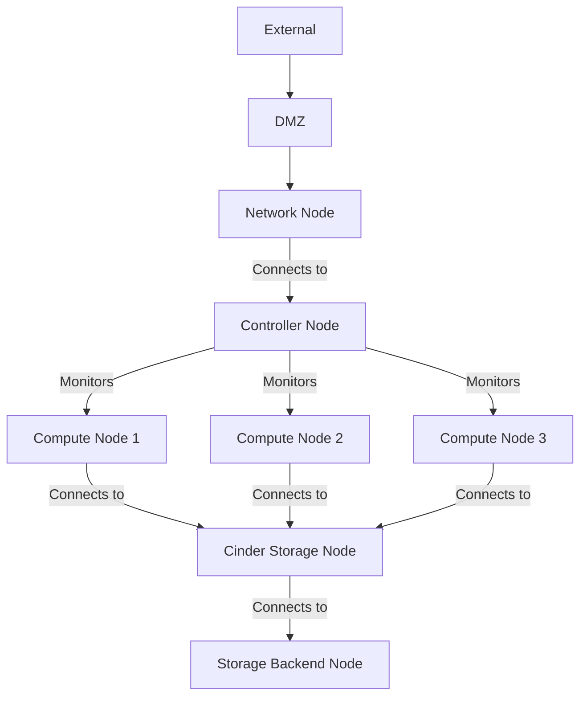

## 1. 클라우드 서비스 & 프라이빗 클라우드 서비스
- 최근에 기업들이 IT 서비스를 Public Cloud 서비스로 전환하는 경우가 많은데 타 기업 과의 자원 공유, IT 자원의 소유권 문제, 법규에 따른 문제, 제어권 주체 변경 등의 논쟁으로 인해 도입을 주저하기도 합니다.
- 이러한 논쟁 때문에 Private Cloud 도입을 검토

### 1)클라우드 컴퓨팅
- 인터넷 기술을 활용하여 확장 가능하고 탄력적인 IT 자원들을 서비스로 제공하는 컴퓨팅

### 2)클라우드 컴퓨팅 특징
- On Demand: 수요자 중심(수요자의 요구에 즉시 대응하는 서비스)
- Elasticity: 탄력성, Scale-Out, Auto-Scaling, SDN
- agility: 민첩성
  - 회복 민첩성
  - 비즈니스 민첩성
  - 서비스 민첩성
- SelfService: 별다른 기술 습득 없이 사용이 가능
- 사용량 기반 과금
- 확장성
- 이용률
- 비용 절감
- 신뢰성

### 3)클라우드 서비스 모델 과 배치 모델
- 서비스 모델
  - IaaS: Infrastructure
  - PaaS: Platform
  - SaaS: Service
  - DaaS: Desktop

- 배치 모델
  - Public Cloud: 이용 대상을 제한하지 않는 클라우드
  - Private Cloud: 이용 대상을 기업의 내부로 제한하는 클라우드
  - Community Cloud: 같은 관심사를 갖는 그룹에 제공하는 클라우드
  - Hybrid Cloud: Private Cloud와 Public Cloud를 혼용해서 제공하는 클라우드
  - Multi Cloud: 2개 이상의 Public Cloud를 사용하는 경우

### 4)용어
- 서비스 개념
  - 클라우드 컴퓨팅 서비스 또는 클라우드 서비스: 클라우드 컴퓨팅을 이용해서 사용자의 요청에 따라 IT자원을 배포, 측정, 관리, 운영하는 IT자원 제공 서비스
  - 클라우드 컴퓨팅: 하드웨어, 소프트웨어 등의 IT 자원을 논리적인 분할이나 결합을 통해서 인터넷을 통해 효율화시킨 컴퓨팅
  - 클라우드 컴퓨팅 기술: 퍼블릭이나 프라이빗 클라우드를 구축할 때 사용하는 하드웨어나 소프트웨어 기술
  - 클라우드 서비스 인프라: IaaS, PaaS, SaaS 서비스를 제공하기 위한 인프라
  - CSP(Cloud Service Provider): 클라우드 서비스를 제공하는 곳으로 AWS, MS Azure, GCP, Naver Cloud, KT Cloud 등
  - MSP(Managed Service Provider): CSP가 제공하는 클라우드 서비스를 고객 환경에 최적화된 구성으로 컨설팅 하는 곳으로 Megazone, 베스핀 글로벌, 클루커스가 대표적
- 플랫폼 관련 용어
  - 클라우드 플랫폼: 사용자의 요청에 따라 클라우드 서비스를 제공하는 관리 체계로 클라우드 서비스를 구축할 수 있도록 도와주는 솔루션
  - 컨트롤러 노드: 클라우드 플랫폼이 설치되어 클라우드 서비스 인프라를 관리하는 기능을 제공하는 서버
  - 컴퓨트 노드: 연산 능력을 제공하는 장비로 일반적으로 하이퍼바이저가 설치되고 가상 머신이 생성되는 서버
  - 스토리지 노드: 가상 머신에 저장소를 제공하기 위한 서비스 서버
  - 네트워크 노드: SDN 서비스나 가상 라우터 서비스를 제공하는 서버
- 클라우드 마이그레이션: 물리 장비에서 클라우드 서비스로 이전하거나 가상화에서 클라우드 서비스로 운영 중인 시스템을 이관하는 작업
- 서비스 유형 관련 용어
  - 가상 머신: 물리 서버에 하이퍼바이저를 설치하고 자원을 통합하고 분할시켜 제공하는 가상의 논리적인 서버 자원
  - 컨테이너: 물리 서버에 설치된 컨테이너가 운영체제 커널을 공유하고 리눅스 격리 기술(namespace isolation)을 이용해서 응용 소프트웨어 만을 위한 별도의 공간을 제공하는 서비스
  - 블록 스토리지: 블록(컴퓨터에서 일반적으로 저장하는 단위) 단위로 데이터를 저장하는 스토리지 서비스로 SAN(Storage Area Network - 가상 네트워크의 분리된 장치에 데이터를 저장하는 방식), NAS(Network Attached Storage: 네트워크에 서버를 두는 형태), DAS(Direct Attached Storage: 연결된 디스크에 데이터를 저장, usb같은) 서비스가 있음
  - Object Storage: 객체 단위로 데이터를 저장하는 스토리지 서비스로 시스템 메타데이터와 사용자 메타데이터를 이용해서 비정형 데이터를 저장하는데 많이 사용하는 방식
- 기술 관련 용어
  - Consolidation: 과거 메인 프레임에서 가능했던 파티셔닝 기술을 이용해서 유닉스 서버나 x86서버에 적용한 것으로 서버를 여러 개로 분할해서 운영할 수 있고 각각 분할된 자원은 isolation을 제공, 이를 이용해서 서버의 이용률을 향상시킬 수 있음
  - SDN(Software Defined Network): 네트워크 가상화 기술로 무엇이 어디로 이동할 지 알려주는 네트워크 관리 기술
  - NFV(Network Function Virtualization): 네트워크 흐름에 대한 가상화 뿐 아니라 방화벽, IPS/IDS 같은 보안, 캐싱, NAT, DPI, 인증 등의 기능을 가상화하는 기술
  - 가상 네트워크: 물리적인 네트워크를 논리적으로 가상화하는 기능으로 격리시켜서 불필요한 브로드캐스트 트래픽을 차단하여 보안성을 강화하고 세그먼트를 분리해서 사용할 수 있는 네트워크 기술
  - 하이퍼바이저: 물리적인 서버에서 다수의 운영체제를 동시에 실행시키기 위한 논리적인 컴퓨터 소프트웨어
  - 클라우드 파운드리: PaaS 서비스를 제공하기 위한 플랫폼으로 Pivotal 사가 주도하고 있는 오픈 소스 플랫폼
  - OpenShift: Apache 재단의 오픈소스 PaaS 서비스 플랫폼
  - 컨버지드 인프라: 서버, 네트워크, 스토리지 등의 독립적인 시스템을 하나로 결합해 놓은 시스템으로 비용, 성능 등의 효율성을 높인 솔루션

### 5)Private Cloud Service
- Public Cloud Service에서 제공하는 서비스를 위해 관리하는 인프라를 관리 운영하는 역할을 사용자가 직접 수행하는 것이 Private Cloud Service
- 서비스 구성
  - 클라우드 서비스 영역의 구성은 크게 클라우드 컴퓨팅 인프라 영역 과 클라우드 서비스 사용 영역으로 나눔
  - 클라우드 컴퓨팅 인프라 영역은 클라우드 서비스를 구축하는 하드웨어나 소프트웨어로 이루어지는 영역   
    가상 머신 서비스를 위한 컴퓨트 노드, 스토리지 서비스를 위한 스토리지 노드, 스토리지 장비, 네트워크 서비스 등이 여기에 해당하고 하이퍼바이저, 리눅스 컨테이너, 모니터링 솔루션 등이 이 계층에서 동작하는 소프트웨어
  - 클라우드 플랫폼 계층   
    클라우드 서비스 도입에 따라 클라우드 컴퓨팅 인프라를 관리하기 위한 플랫폼   
    Open Stack, Citrix 의 Cloud Stack, MS 의 System Center 같은 소프트웨어를 이용해서 구축   
    별도의 조직을 구성해서 이를 관리
  - 클라우드 포털 계층   
    클라우드 플랫폼과 연동해서 운영자의 인터페이스 역할을 담당   
    대부분 웹 서비스로 구성   
    사용자의 셀프 서비스를 위한 사용자 포털과 운영 및 관리를 위한 운영자 포털로 구성
  - 클라우드 서비스 제공 계층   
    가상 머신 서비스나 스토리지 서비스 그리고 로드밸런서 서비스 등의 클라우드 자원을 활용하는 서비스를 제공하는 영역
  - 미들웨어 서비스 계층   
    응용 소프트웨어가 사전에 설치되어 있는 템플릿 서비스 계층   
    Apache Tomcat, JBoss, Database 를 제공
  - Private Cloud 와 Public Cloud Service 의 차이
    - 이용 대상의 제한 여부
    - DMZ(DeMilitarized Zone: 내부 네트워크 와 외부 네트워크 서비스를 제공하면서 내부 네트워크를 보호하는 서비스넷) 안에서 클라우드 서비스를 구축하고 DMZ를 이용해서 외부에서 사용이 가능하면 Public Cloud 이고 그렇지 않으면 Private Cloud
- Private Cloud Service 도입의 변화
  - Cloud Service Infra 에 대한 개념
  - Commercial Software -> Open Source Software
  - Single Tenant -> Multi Tenants
  - Physicalization -> Virtualization
  - Unix -> Linux

### 6)private cloud service 유형
- 연산 서비스 구분
  - 가상 머신
  - 컨테이너
  - 자동 확장
- 저장소 서비스
  - 블록 스토리지
  - 오브젝트 스토리지
  - CDN
  - 백업 저장소
- 네트워크 서비스
  - Load Balancer
  - DNS
- 관리 및 보안 서비스
  - 모니터링 및 로그
  - 접근 관리
  - 웹 방화벽
  - 침입 차단
  - 방화벽

### 7)가상 머신
- 클라우드에선 물리적인 서버를 가상 머신으로 제공
- 가상 머신 서비스를 제공할 때 가장 중요한 것은 고가용성
- 유형
  - CPU 유형이나 개수에 따른 분류: Core 개수나 GPU 성능 등
  - 메모리 사이즈에 따른 분류
  - 운영체제에 대한 분류
  - 하이퍼바이저 유형에 따른 분류: ESXi, KVM(Open Stack의 영향으로 최근에 많이 사용, RedHat, HP, Open KVM에서 이용용), Xen(과거에 많이 사용, AWS, KT 등에서 사용),Windows에서는 Hyper-V, 오라클에서 지원하는 OVM 등   
  하나의 클라우드 서비스에서는 하나의 하이퍼바이저 만을 사용하는 것을 권장나의 클라우드 서비스에서는 하나의 하이퍼바이저 만을 사용하는 것을 권장

## 2.클라우드 서비스 구축
### 1)개념적인 구조
- 클라우드 포털(최상위): 사용자 포털 & 운영자 포털(가상 머신 관리, 서비스 관리, 사용자 관리, 대시보드, 요금관리)
- 클라우드 플랫폼: 오픈 스택, 클라우드 스택, 시스템 스택(클라우드 관리, 이미지 관리, 모니터링, 과금 관리, 용량 관리)
- 가상화 계층: 하이퍼바이저(서버 가상화, 네트워크 가상화, 스토리지 가상화, 보안 가상화)
- 물리 계층(하드웨어, 최하위)

- 프라이빗 클라우드 구축 관점에서 바라보면 기반이 되는 물리 환경을 설계하고 그 위에 가상화를 위한 하이퍼바이저를 포함하여 클라우드 플랫폼을 설치하고 클라우드 서비스를 구성하는데 클라우드 포털의 구성 도 함께 진행

### 2)오픈 스택 기반 클라우드 플랫폼 설계
- 클라우드 플랫폼
  - 클라우드 환경 구축하고 운영할 수 있도록 필요한 구성 요소들을 제공하는 플랫폼 소프트웨어
  - 사용자 인증과 관리 기능을 기반으로 대규모의 가상 서버와 스토리지 그리고 네트워크를 구성하고 운영할 수 있는 다양한 기능을 제공하는 패키지화된 소프트웨어
  - 클라우드 서비스 구성 및 운영을 위한 다수의 서비스 컴포넌트로 구성되고 각각의 서비스 컴포넌트는 필요한 기능을 API 형태로 제공
  - 대시보드를 이용해서 각종 현황을 제공하고 사용자 와 관리자 포털도 서비스 컴포넌트들이 제공하는 API들을 이용하여 관리하고 운영할 수 있는 기능을 제공
- 클라우드 플랫폼 선택
  - Open Stack   
    AT&T, IBM, HP, RackSpace, RedHat, Canonical, SUSE 등의 프라이머리 멤버십이며 Cisco, Dell, ClearPath 등이 골드 멤버
  - Eucalyptus: 최근 HP가 인수를 했는데 AWS 와 호환성 우수
  - CloudStack: 아파치 재단에서 서비스 중인데 GoDady, KT, Tata, logicwork 등이 상용 서비스로 사용
- 벤더 의존도 및 호환성
  - 프라이빗 클라우드를 구성하는 장비를 선택할 때 특정 벤더에 의존해야 한다면 그 벤더에 종속(Lock-In)되는 기능으로 구현해야 하는 경우가 많음
  - AWS와 같이 사용하고자 한다면 Eucalyptus나 Cloud Stack을 사용하는 것이 좋음
- 유지 운영 및 기술 지원 문제 고려
- 비용 효율성
- 개발 지원
  - Open API나 IDE plugin 지원 여부
  - 개발자 커뮤니티 확인
- 에코 시스템
  - 함께 연계하거나 활용 가능한 오픈소스 소프트웨어를 가능한 많이 사용
- 릴리즈 선택
  - 일반적으로는 최신 버전이 좋지만 안정성이 입증된 구 버전을 선택하기도 함

### 3)오픈스택 구조
- 크게 나누면 네트워크 컴포넌트와 오픈 스택 컴포넌트로 구분
- 네트워크 컴포넌트는 프라이빗 클라우드 서비스 보호를 위한 방화벽 등의 보안 시스템과 네트워킹 및 부하 분산을 위한 L3 및 L4 스위치로 구성
- 서비스 컴포넌트
  - 기본적인 구성은 Controller Node 와 Compute Node 이고 여기에 Storage Node 와 Network Node를 추가하는 것이 가능
  - 스토리지 백엔드를 하단에 배치하는데 이는 스토리지 노드에 저장 공간을 제공하는 스토리지 시스템
  - 네트워크 노드는 컨트롤러 노드와 통합하여 구성할 수 있고 별도로 구성할 수 도 있는데 이를 구성하는 이유는 고급 네트워크 기능(DHCP, SNAT, DNAT)을 사용하기 위해서 구성하지만 단일 장애점의 이슈와 성능 이슈가 존재하기 때문에 최근에는 Neutron 에서 제공하는 DVR을 사용해서 구현하기도 합니다. 다른 방법으로는 컨트롤러 노드에 통합을 시키고 HA를 구성하는 방법도 있음

```
External - DMZ - Network Node > Compute Node 3개가 Storage Node(cinder)와 연결 - Storage Backend
Controller Node가 Compute Node 3개를 감시
Storage Node(swift)-Storage Backend
```

- Open Stack을 구성하는 Service Component
  - 6개의 코어 서비스 와 13개의 옵셔널 서비스로 구성
  - 6개의 코어 서비스는 NOVA(Compute), NEUTRON(Networking), SWIFT(Object Storage), CINDER(Block Storage), KEYSTONE(Identity), GLANCE(가상 머신을 위한 디스크 이미지) 인데 Cinder 와 SWIFT를 제외한 4개의 서비스는 필수
  - 각각의 서비스는 모두 단위 프로젝트 형태로 개발되며 개별적으로 완성도를 가름할 수 있는 성숙도를 관리
  - 서비스들은 모듈 형태로 구성해서 결합이 가능하고 결합을 할 때는 REST API와 Message Queue를 사용한 약한 결합의 구조
  - 옵셔널 서비스   
    Elastic Map Reduce를 위한 Sahara: Hadoop 클러스터를 간단한 방법으로 제공하는 서비스
  - Bare-Metal을 위한 Ironic: 하이퍼바이저 위에 동작하는 가상 머신을 대신하여 비어있는 컴퓨터를 컴퓨터 인스턴스로 사용할 수 있도록 지원
  - Messaging 서비스를 위한 Zaqar: 다양한 커뮤니케이션 컴포넌트 들이 메시지를 주고 받을 있는 API를 제공
  - Shared File System 서비스를 위한 Manila: NFS 나 CIFS를 이용한 공유 파일 시스템을 대체하기 위한 프로젝트인데 가상 머신 간에 공유 가능한 파일을 제공   
  Cinder는 하나의 가상 머신에서만 접근이 가능한 스토리지
  - DNS 서비스를 위한 Designate: DNS의 기능을 서비스로 제공
  - Key Management 서비스를 위한 Barbican: 각종 비밀번호, 암호화 키, 등을 안전하게 보관하기 위한 공간을 제공하기 위한 프로젝트
  - Containers 서비스를 위한 Magnum: Docker 또는 Kubernetes 같은 컨테이너 서비스를 Open Stack에 통합하기 위한 프로젝트   
    Docker와 Kubernetes를 포함한 운영체제 이미지를 제공하기 위해서 Heat를 사용하고 그 운영체제 이미지를 가상 머신 또는 베어메탈 서버에서 실행하여 컨테이너 서비스를 제공
  - Application Catalog 서비스를 위한 Murano: 클라우드에서 구동이 가능한 애플리케이션들을 카테고리 형태로 정리해서 카탈로그를 제공하고 배포를 가능하게 하는 기능을 제공
  - 클라우드를 구축할 때 모든 오픈 스택 서비스를 사용하는 것은 아니며 구성 방식에 따라 해당 서비스를 어떤 노드에 설치할 것인가도 달라지고 이중화 요구 사항 과 성능 요구 사항에 따라 코어 서비스 와 옵셔널 서비스를 추가할 지 이중화 할 지 결정
- 노드 배치의 기본
  - Controller Node: Horizon, Keystone, Nova API, Glance, Neutron, Cinder API, Heat, Ceilometer, HAProxy, Keepalived, Ansible, ElasticSearch + Logstash, Monasca
  - Compute Node: Nova, Neutron, Hypervisor, Ceilometer Agent
  - Block Storage Node: Cinder, Ceilometer Agent
  - Object Storage Node: Swift, Ceilometer Agent

- 기타 서비스 컴포넌트의 역할
  - HAProxy와 Keepalived는 컨트롤러 노드 클러스터링을 위해서 필요   
    Controller 노드는 통상적으로 3개의 노드로 구성
  - Elastic Search와 Log Stash: 다양한 서비스에서 발생하는 로그를 통합하고 가공하기 위해서 사용
  - Ansible은 반복적으로 발생하는 작업을 스크립트화해서 스크립트의 실행 또는 패키지의 배포와 설정 및 실행 등을 자동화하는 기능
  - Monasca는 프라이빗 클라우드의 모니터링 기능을 수행

### 4)서비스 컴포넌트의 역할
- Horizon
  - 대시보드 서비스
  - 웹을 통해서 사용자나 관리자가 오픈 스택의 자원과 서비스를 이용할 수 있도록 사용자 인터페이스를 제공하는 서비스
  - 템플릿과 도구를 이용해서 약간의 커스터마이징이 가능
  - 기본적인 클라우드 운영이 가능
  - 통상적으로 Controller 노드에 설치하고 아파치 웹 서버를 이용
  - 사용자와 관리자는 Horizon을 이용해서 가상 머신을 생성하거나 가상 머신에 네트워크를 구성하고 IP를 지정하거나 보안 규칙을 설정하는 등 다양한 기능을 사용
  - 사용자 또는 관리자가 VNC Client를 이용해서 가상 머신의 콘솔에 웹 브라우저를 이용해서 접속이 가능
  - 웹 브라우저는 HTML5의 Canvas 기능과 Web Socket을 지원해야 함
- Nova
  - Compute 서비스를 위한 컴포넌트
  - 컴퓨트 노드에 설치해서 CPU, Memory, Network, Storage를 이용해서 가상 머신 서비스를 제공
  - Open Stack이 IaaS를 제공할 수 있게 해줌
  - Nova가 가상화의 기능을 포함하지 않기 때문에 하이퍼바이저 종류를 다르게 하면 드라이버를 변경된 하이퍼바이저의 드라이버로 대체
  - 다수의 컴퓨트 노드에 독립적으로 설치되고 컴퓨터 노드들은 서로 아무것도 공유하지 않는 구조로 만들어짐: 하나의 노드에 장애가 발생하더라도 다른 노드에는 장애가 전파되지 않음
- Neutron
  - Networking 서비스를 위한 컴포넌트
  - Nova가 관리하는 가상 머신이 사용하는 네트워크, 스위치, 서브넷 및 라우터를 포함해서 가상 네트워크 인프라의 생성과 관리를 처리하는 서비스
  - 가상 방화벽이나 VPN, 로드밸런서와 같은 고급 서비스도 지원
- Swift
  - Object Storage 서비스
  - 비정형 객체를 저장하는 저장 공간 서비스
  - 파일 또는 파일의 묶음인 폴더와 같은 컨테이너 형태를 지원하며 HTTP 기반으로 Restful API를 통해서 서비스를 제공
  - 주로 백업 과 가상 머신 이미지, 사진, 비디오, 음원 등 아카이브 데이터의 저장 공간으로 사용되지만 N 드라이브라 구글 드라이브 와 같은 클라우드 디스크 서비스 형태로 단독 구성하는 것도 가능
- Cinder
  - Block Storage 서비스
  - 컨트롤러 노드 와 컴퓨트 노드에 설치하거나 독립적인 스토리지 노드로 분리하여 구성할 수 있습니다.
  - 컨트롤러 노드에 설치하는 것은 성능적인 면이나 가용성 측면에서 좋은 구성은 아니지만 테스트 환경을 구성하는 경우에는 충분한 노드 확보가 어렵기 때문에 이런 구성을 사용하기도 합니다.
- Keystone
  - Identity 서비스
  - 이 서비스가 중단되면 오픈 스택의 어떤 서비스에도 접근할 수 없는 상태가 됩니다.
  - 사용자 관리나 보안 그룹 관리 REST 기반 API를 제공하는 각종 서비스의 Endpoint URL을 관리하는 기능도 제공
- Glance
  - 오픈 스택이 제공하는 이미지 서비스
  - 이미지 종류로는 운영체제를 설치하기 위한 이미지, 설치가 완료되서 서비스가 가능한 이미지, 운영 중인 운영 체제를 복제해서 만든 이미지, P2V(물리 서버를 하나의 가상 머신으로 컨버팅하는 기술)나 V2V(가상 머신을 KVM으로 옮기는 기술) 도구를 이용해서 생성한 이미지, 백업을 위해서 복제한 스냅샷 이미지 등이 있음
  - 오픈 스택에서는 Flat 이미지 파일인 raw, AMI/AKI/ARI 와 같은 Amazon의 EC2 이미지, qcow2와 같은 KVM 하이퍼바이저가 사용하는 이미지, VDI와 같은 Oracle의 Virtual Box, VMDK와 같은 VMWare의 ESX.ESXi 용 이미지, VHD와 같은 MS의 Hyper-V가 사용하는 이미지 그리고 ISO 파일을 지원
  - 운영체제를 설치할 때 콘솔을 통해서 운영체제를 설치하는 것은 가능하지만 번거롭기 때문에 운영체제가 설치된 이미지를 Glance에 등록해두고 가상 머신을 생성할 때 이미지를 복제해서 사용
  - 운영체제 이미지를 생성하고자 하는 경우에는 Diskimage-builder 나 Oz 같은 도구를 이용해서 이미지를 생성하는 것이 가능
- Ceilometer
  - Telemetry 서비스
  - 크라우드에서 발생하는 각종 정보를 측정해서 사용량 조회, 과금, 사용 내역 조회 등을 사용자에게 제공하는 서비스
  - 정보를 저장하기 위해서 NoSQL 데이터베이스가 필요하며 오픈 스택에서는 Mongo DB를 권장
- Heat
  - 통합 관리 서비스를 제공
  - 텍스트 파일 형태로 제공되는 HOT라는 템플릿 파일을 기반으로 여러 유형의 복합 클라우드 응용 프로그램을 배포할 수 있는 통합 관리 엔진
  - AWS의 CloudFormation 템플릿과 호환성을 유지하기 위해서 개선
  - 가상 머신의 자원 할당, 설정 변경, 부하에 따른 머신 오토스케일링 등을 자동화해주는 도구
  - 애플리케이션 자동 배포를 YAML로 작성

### 5)오픈 스택 서비스 구현 사례
- IaaS 서비스를 제공하는 퍼블릭 클라우드
  - Core Service: Cinder, Glance, Keystone, Neutron, Nova, Swift
  - Optional Service: Designate

- HTC를 위한 오픈 스택 서비스 구성
  - Core Service: Cinder, Glance, Keystone, Nova
  - Optional Service: Ceilometer, Heat, Horizon

- Big Data 처리를 위한 서비스 구성
  - Core Service: Glance, Keystone, Neutron, Nova
  - Optional Service: Sahara(Hadoop 이나 Spark 때문), Ironic, Horizon

- 오픈 스택 초보자에게 권장하는 구성
  - Core Service: Glance, Keystone, Neutron, Nova
  - Optional Service: Horizon


### 6)추가 서비스 컴포넌트
- Elastic Search 와 LogStash
- Elastic Search   
  Apache Lucene 프로젝트를 기반으로 탄생한 검색 엔진   
  클라우드 내에서 수 많은 로그가 빠른 속도로 생산되기 때문에 로그를 찾아보는 데 어려움이 많은데 Elastic Search는 분산 처리 와 클러스터링을 지원해서 빠르게 원하는 정보를 찾을 수 있습니다.

- Logstach   
  Input -> Filter -> Output 의 단계로 로그를 수집하고 가공하고 저장하는 기능을 제공해서 단순한 로그 통합이 아닌 자동화와 관리 기능을 구현   
  문자열을 가공할 수 있는 다 다양한 필터도 제공하고 JSON 포맷을 지원하기 때문에 프로그래밍에 이용하기가 좋음   
  다양한 플러그인을 지원하기 때문에 여러 형태로 사용이 가능   
  Logstash에서 아웃풋 플러그인을 사용하면 ElasticSearch로 보내 즉시 색인이 가능   
  Elastic Search 와 Logstach로 처리한 데이터에 보다 쉽게 접근해서 시각적으로 보고자하는 경우 Kibana를 추가로 설치하면 되는데 이 때는 Elasticsearch의 플러그인 형태로 설치   
  로그 수집만을 원하면 Loghost 나 Splunk를 사용
- HAProxy
  - 클러스터링 구성을 위한 오픈 소스 프로젝트
  - 컨트롤러 노드 이중화로도 사용할 수 있지만 L4 스위치의 기능을 대신할 수 있음
  - 복수의 노드 간에 Heart Beat를 교환해서 장애를 감지해서 Active-Standby 클러스터링 아키텍쳐를 구현
- Keepalived
  - 클러스터링 구성에 사용
- Ansible
  - 멀티 노드 환경에서 소프트웨어의 배포, 환경 설정 자동 생성, 관리 자동화 등을 제공
- Chef
  - Ansible 과 동일한 기능을 수행
- Monasca
  - 오픈 소스 모니터링 도구
  - MySQL 데이터베이스를 이용해서 알람 과 이벤트를 관리 가능

## 3.Cent OS 설치 및 기본 설정
### 1)Red Hat Linux
- Fedora
  - Red Hat에서 지원하는 페도라 프로젝트가 개발하는 리눅스
  - 무료로 제공되는 리눅스 버전
  - Red Hat의 Beta 버전 성격
- Cent OS
  - Red Hat Enterprise의 Clone Linux
  - 8버전 부터 Red Hat이 더 이상 Cent OS를 지원하지 않는다고 해서 Cent OS 초기 개발자가 만든 버전이 Rocky이고 RHEL의 Clone이 아니고 RHEL의 베타 버전 성격의 리눅스를 Cent OS Stream 이라고 이름을 붙임
- RHEL
  - Red Hat Enterprise Linux
  - 상용화된 리눅스로 설치나 문제 해결에 대한 기술 지원을 받을 수 있음

### 2)설치
- Rocky 의 ISO 파일을 다운로드 받아서 설치
- Mac의 경우 UTM에서 설치를 한 경우 처음에 부팅이 안될 수 있는데 이 경우는 GRUB으로 들어간 후 exit를 입력해서 빠져나오면 다음 부터는 정상적인 부팅이 이루어집니다.
- Virtual Box에서 Rocky 리눅스를 포함시켜 VM 생성했을 때 Check Sum 오류 발생
  - VM 의 전원을 종료
  - [설정]으로 접속
  - 저장소 탭에서 기존 저장소의 컨트롤러:IDE를 삭제한 후 하단의 [추가] - [광학드라이브]를 선택해서 ISO 파일을 선택한 후 설치를 진행

## 3.기본 환경 구성
### 1)hostname 설정
- `hostnamectl set-hostname <호스트이름>`

### 2)Network 설정
- NetworkManager
  - Cent OS 8 이상에서는 NetworkManager 서비스를 이용해서 네트워크 관리를 수행
  - nmcli 라는 도구를 이용해서 네트워크 설정을 수행하는데 nmtui 나 GNOME 의 설정 모드에서 수행이 가능
  - 설치 여부 확인: `rpm -q NetworkManager`
- nmcli 는 NetworkManager의 패키지의 일부로 설치되므로 사용법을 확인   
  `nmcli --help`
  - `nmcli connection show`: 연결된 네트워크 확인
  - `nmcli general status`: 전체 상태 확인
  - `nmcli device status`: 시스템에 설치된 장치의 상태를 확인
- 네트워크 인터페이스 설정
  - IP 설정   
    `nmcli connection modify 디바이스이름 ipv4.address 아이피/서브넷마스크`
  - 게이트웨이 설정   
    `nmcli connection modify 디바이스이름 ipv4.gateway 아이피`
  - DNS 설정   
    `nmcli connection modify 디바이스이름 ipv4.dns 아이피`
  - 네트워크 인터페이스를 재시작   
    `nmcli connection up 디바이스이름`
- 스크립트로 수정이 가능:   
  /etc/sysconfig/network-scripts/ifcfg-디바이스이름   
  키=값의 형태로 설정

### 3)패키지 관련 명령
- 형식   
  `yum [옵션] [명령어] [패키지이름]`
- 설치: 관리자 권한 필요   
  `yum install <패키지이름>`   
  설치 할 때 `-y` 옵션을 추가하면 설치 시 실제 설치를 할 것인지 묻지 않음
- 패키지 삭제   
  `yum erase` 또는 `remove <패키지이름>`
  - 지울 때 의존하는 패키지도 같이 삭제됨
- 패키지 검색   
  `yum search <패키지이름>`
- 패키지 정보 확인   
  `yum info <패키지이름>`
- yum 대신에 이전에는 rpm을 사용

