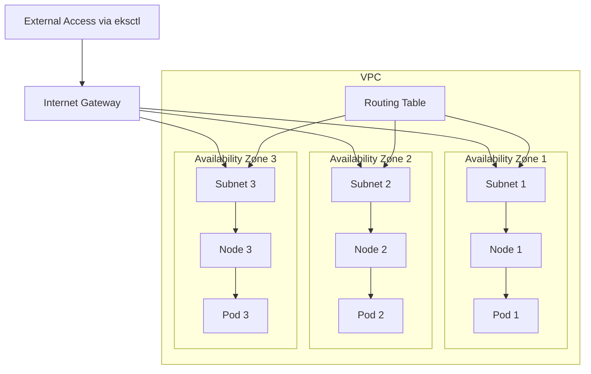

## 참고지식
### VPC

가상의 네트워크 대역이다. VPC에 서브넷을 하나씩 주고 서브넷에는 노드가 하나씩 있다. 각 서브넷에 가용영역을 하나씩 할당해주면 가용영역이 VPC로 묶이게 된다. 노드에 파드를 하나씩 할당하면 파드와 노드는 완전히 분리된 가용영역에 위치하게 된다.

각 서브넷의 IP는 가상IP이다. 우리가 EKSCTL 명령은 외부 인터넷에서 사용하는 것이다. VPC에 인터넷 게이트웨이를 달아 인터넷에서 접속할 수 있게 해준다. VPC는 L2 스위치와 유사하다고 생각하면 편하다. (L2 스위치는 MAC주소만 기억)

서브넷 간에는 라우팅 테이블이 필요하다. 서로 다른 네트워크 일 때는 라우팅 방법이 제공되어야 한다. 라우팅 방법으로 RIP와 OSPF가 있다. OSPF가 최신 방법이다.

위의 다이어그램에 RDS를 위한 서브넷을 추가한다. 서브넷 추가 시 라우팅 테이블에 서브넷을 추가해줘야 한다.
```
L2 switch - (gateway)Router <-> 인터넷
```
- Region > AZ
- 서울 region에는 가용영역이 4개가 있다

### Docker Push Error
- Docker는 기본적으로 Docker Hub에만 Push 가능
- Docker Hub 이외의 곳에 Push 할 때는 daemon.json 파일에 저장소 이름을 추가하고 인증을 받아야 함
- ECR 사용할 때 에러 발생 시 로그인을 해주면 됨

### 쿠버네티스의 계층
쿠버네티스에는 계층이 존재한다. 상위 계층을 만들면 하위 계층이 자동으로 생성된다.
```
Load Balancer
Node Port
ClusterIP
-------------
Deployment
ReplicaSet
Pod
-------------
CronJob
Job
```
### AoP와 SideCar
- 프록시 패턴
- 스프링에서는 Business Logic 앞뒤에 Common Concern을 annotation을 붙여 새로운 인스턴스 생성
- 내가 만든 코드에 새로운 코드가 추가되어 인스턴스가 생성
- 쿠버네티스에서는 사이드카패턴이라 불림
- 프록시 객체를 내가 만든 객체가 상속

### 프록시와 CORS
- javascript는 자신의 도메인 내의 자원만 사용 가능하다
- 다른 도메인에서 데이터를 가져오려면 프록시를 사용하거나 가져오려는 서버에 CORS 설정을 해줘야 함

## 1.CloudFormation 으로 구축한 리소스
### 0)쿠버네티스 클러스터 생성 과정
- VPC 생성
- eksctl을 이용해서 VPC의 subnets를 이용해서 클러스터를 생성
### 1)base_resources_cfn.yaml: VPC를 생성하기 위한 CloudFormation 파일
- Parameters 부분은 변수 설정
- 리소스 부분
- VPC 생성 부분
```yaml
EksWorkVPC:
    Type: AWS::EC2::VPC
```
- VPC 안에서 사용할 서브넷으로 현재는 3개인데 위에 subnet을 추가하면 더 배치가 가능(AZ는 한국의 경우 4개 밖에 없으므로 5개 이상을 생성하고자 하는 경우에는 AZ를 중복시켜야 함)  
```yaml
WorkerSubnet1:
   		Type: AWS::EC2::Subnet
```
- 인터넷 게이트웨이 설정: 이 설정이 있어야 안에 만들어지는 노드들이 인터넷이 가능 - 게이트웨이를 생성하고 부착하는 부분
```yaml
  InternetGateway:
    Type: AWS::EC2::InternetGateway

  VPCGatewayAttachment:
    Type: AWS::EC2::VPCGatewayAttachment
    Properties:
      InternetGatewayId: !Ref InternetGateway
      VpcId: !Ref EksWorkVPC
```
- 라우팅 테이블을 만드는 부분
```yaml
WorkerSubnetRouteTable:
    Type: AWS::EC2::RouteTable
    Properties:
      VpcId: !Ref EksWorkVPC
      Tags:
        - Key: Name
          Value: !Sub ${ClusterBaseName}-WorkerSubnetRouteTable

  WorkerSubnetRoute:
    Type: AWS::EC2::Route
    Properties:
      RouteTableId: !Ref WorkerSubnetRouteTable
      DestinationCidrBlock: 0.0.0.0/0
      GatewayId: !Ref InternetGateway

  WorkerSubnet1RouteTableAssociation:
    Type: AWS::EC2::SubnetRouteTableAssociation
    Properties:
      SubnetId: !Ref WorkerSubnet1
      RouteTableId: !Ref WorkerSubnetRouteTable

  WorkerSubnet2RouteTableAssociation:
    Type: AWS::EC2::SubnetRouteTableAssociation
    Properties:
      SubnetId: !Ref WorkerSubnet2
      RouteTableId: !Ref WorkerSubnetRouteTable

  WorkerSubnet3RouteTableAssociation:
    Type: AWS::EC2::SubnetRouteTableAssociation
    Properties:
      SubnetId: !Ref WorkerSubnet3
      RouteTableId: !Ref WorkerSubnetRouteTable
```
- 다른 곳에서 사용할 정보를 외부에 출력하기 위한 부분이다. eksctl로 클러스터 생성 시 사용된다.
```yaml
Outputs:
  VPC:
    Value: !Ref EksWorkVPC

  WorkerSubnets:
    Value: !Join
      - ","
      - [!Ref WorkerSubnet1, !Ref WorkerSubnet2, !Ref WorkerSubnet3]

  RouteTable:
    Value: !Ref WorkerSubnetRouteTable
```
  - 서브넷을 출력한 이유는 이 서브넷을 알아야 eks 가 node 컴퓨터에 주소를 할당해서 배치를 하기 때문입니다.
  - Route 테이블을 출력한 이유는 다른 서브넷을 추가할 경우  라우팅 테이블에 서브넷을 추가해야만 그 서브넷에 다른 서브넷에서 접근이 가능하기 때문에

### 2)클러스터 생성 명령
```
eksctl create cluster 
--vpc-public-subnets VPC의Subnets값
--name 클러스터이름(하나의 컴퓨터 내에서는 중복이 안되지만 다른 컴퓨터의 경우는 중복 가능)
--region 리전이름
--version 버전(1.xx: 현재는 24 부터 31까지 지원 - 쿠버네티스 관련 명령은 kubectl 을 이용하는데 AWS에서는 하나 이전 버전까지는 문제가 없을 거라고 합니다.)
--nodegroup-name 노드그룹이름(중복 가능)
--node-type 인스턴스하드웨어종류(사용할 수 있는 값이 제한적)
--nodes 노드의개수
--nodes-min  최소 노드의 개수
--nodes-max 최대 노드의 개수 
```
```
eksctl create cluster --vpc-public-subnets subnet-0f3d3d126db2bee57,subnet-0abea07a4425d377c,subnet-03f06b0e223706343 --name eks-work-cluster --region ap-northeast-2 --version 1.31 --nodegroup-name eks-work-node --node-type t2.micro --nodes 3 --nodes-min 3 --nodes-max 5
```
- 2개의 스택 생성
  - 첫번째 스택은 ControlPlane에 대한 리소스를 설정하는데 이 때 IAM 설정이 같이 이루어짐
  - 두번째 스택은 WorkerNode에 대한 리소스를 생성하는 스택으로 보안 그룹도 함께 생성됨   
    이 때 ECR을 읽을 수 있는 권한도 추가가 됨   
    포트도 기본적으로 1025~65535번까지를 열어주고 443번 포트도 기본적으로 같이 열어줌

### 3)VPC 안에 RDS를 만드는 YAML 파일
- RDS 서브넷 정의
```yaml
  RdsSubnet1:
    Type: AWS::EC2::Subnet
    Properties:
      AvailabilityZone: !Ref AvailabilityZone1
      CidrBlock: !Ref RdsSubnet1Block
      VpcId: !Ref EksWorkVPC

  RdsSubnet2:
    Type: AWS::EC2::Subnet
    Properties:
      AvailabilityZone: !Ref AvailabilityZone2
      CidrBlock: !Ref RdsSubnet2Block
      VpcId: !Ref EksWorkVPC
```
  - 단일 구성이어도 서브넷 여러 개를 묶은 서브넷 그룹을 만들어야 하기 때문에 2개의 다른 AZ에 속하는 서브넷 그룹을 생성

- 보안 그룹을 생성
```yaml
  RdsSecurityGroup:
    Type: AWS::EC2::SecurityGroup
    Properties:
      GroupDescription: Security Group for RDS
      VpcId: !Ref EksWorkVPC
```
- 보안 그룹을 적용하는데 앞에서 만든 워커 노드용 서브넷 과 배스천 호스트용 서브넷에서 5432 번 포트로 접근이 가능하도록 설정
```yaml
  RdsIngressPostgreSQLWorker1:
    Type: AWS::EC2::SecurityGroupIngress
    Properties:
      GroupId: !Ref RdsSecurityGroup
      CidrIp: !Ref WorkerSubnet1Block
      IpProtocol: tcp
      FromPort: 5432 # mysql 3306 mariadb 3306 postgresql 5432
      ToPort: 5432

  RdsIngressPostgreSQLWorker2:
    Type: AWS::EC2::SecurityGroupIngress
    Properties:
      GroupId: !Ref RdsSecurityGroup
      CidrIp: !Ref WorkerSubnet2Block
      IpProtocol: tcp
      FromPort: 5432
      ToPort: 5432

  RdsIngressPostgreSQLWorker3:
    Type: AWS::EC2::SecurityGroupIngress
    Properties:
      GroupId: !Ref RdsSecurityGroup
      CidrIp: !Ref WorkerSubnet3Block
      IpProtocol: tcp
      FromPort: 5432
      ToPort: 5432

  RdsIngressPostgreSQLOpe:
    Type: AWS::EC2::SecurityGroupIngress
    Properties:
      GroupId: !Ref RdsSecurityGroup
      CidrIp: !Ref OpeSubnetBlock
      IpProtocol: tcp
      FromPort: 5432
      ToPort: 5432
```
- RDS 인스턴스를 정의
```yaml
  EksWorkDB:
    Type: "AWS::RDS::DBInstance"
    Properties:
      DBInstanceIdentifier: eks-work-db
      Engine: postgres  # https://docs.aws.amazon.com/AWSCloudFormation/latest/UserGuide/aws-properties-rds-database-instance.html#aws-properties-rds-database-instance-properties
      EngineVersion: 11  # https://docs.aws.amazon.com/AmazonRDS/latest/UserGuide/CHAP_MySQL.html#MySQL.Concepts.VersionMgmt
      DBInstanceClass: db.t3.micro
      AllocatedStorage: 30
      StorageType: gp2
      DBName: eksworkdb
      MasterUsername: !Join ['', ['{{resolve:secretsmanager:', !Ref RdsMasterSecret, ':SecretString:username}}' ]]
      MasterUserPassword: !Join ['', ['{{resolve:secretsmanager:', !Ref RdsMasterSecret, ':SecretString:password}}' ]]
      DBSubnetGroupName: !Ref EksWorkDBSubnetGroup
      PubliclyAccessible: false
      MultiAZ: false
      PreferredBackupWindow: 18:00-18:30
      PreferredMaintenanceWindow: sat:19:00-sat:19:30
      AutoMinorVersionUpgrade: false
      DBParameterGroupName: !Ref EksWorkDBParameterGroup
      VPCSecurityGroups:
        - !Ref RdsSecurityGroup
      CopyTagsToSnapshot: true
      BackupRetentionPeriod: 7
      DeletionProtection: false
```
- 루트 유저와 일반 유저의 비밀번호 설정
```yaml
  RdsMasterSecret:
    Type: AWS::SecretsManager::Secret
    Properties:
      GenerateSecretString:
        SecretStringTemplate: '{"username": "eksdbadmin"}'
        GenerateStringKey: 'password'
        PasswordLength: 16
        ExcludeCharacters: '"@/\'''
      Name: RdsMasterSecret

  RdsUserSecret:
    Type: AWS::SecretsManager::Secret
    Properties:
      GenerateSecretString:
        SecretStringTemplate: '{"username": "mywork"}'
        GenerateStringKey: 'password'
        PasswordLength: 16
        ExcludeCharacters: '"@/\''{}#%&*<>[]^`|'
      Name: RdsUserSecret

  RdsSecretAttachment:
    Type: AWS::SecretsManager::SecretTargetAttachment
    Properties:
      SecretId: !Ref RdsMasterSecret
      TargetId: !Ref EksWorkDB
      TargetType: AWS::RDS::DBInstance
```
- 나머지 부분은 RDS에 접근할 수 있는 배스천 호스트에 대한 설정
- RDS 접속 포인트를 출력
```yaml
Outputs:
  RDSEndpoint:
    Value: !GetAtt EksWorkDB.Endpoint.Address
```
## 2. 생성된 VPC에 RDS를 이용해서 PostgreSQL을 설치하고 접속해서 SQL 작업 수행
### 1)CloudFormation에서 템플릿을 선택해서 스택을 생성
- EksWorkVPC 파라미터에서 생성하고자 하는 VPC를 선택
- OpeServerRouteTable 파라미터는 이전 스택의 출력에서 찾아서 입력

### 2)만들어진 RDS에 접속
- 세션 관리자에서 접속을 수행
  - 세션 시작을 누르고 원하는 인스턴스를 선택: RDS를 설치할 때 선택한 VPC 내에 있는 인스턴스를 선택
  - SSH를 접속한 것 처럼 접속이 됩니다.
- Postgre SQL에 접속을 해야 하기 때문에 클라이언트 프로그램 설치 `sudo amazon-linux-extras install -y postgresql11`
- 데이터베이스 End Point 확인: CloudFormation에서 스택한 후 출력을 선택하거나 RDS에서 생성된 데이터베이스의 End Point 확인   
`eks-work-db.cesn3uejbkwe.ap-northeast-2.rds.amazonaws.com`
- 데이터베이스 관리자 비밀번호와 유저 비밀번호를 확인: Secrets Manger에서 확인
- 사용자 생성   
`createuser -d -U eksdbadmin -P -h eks-work-db.cesn3uejbkwe.ap-northeast-2.rds.amazonaws.com mywork`
  - eksdbadmin은 관리자 계정
  - eks-work-db.cesn3uejbkwe.ap-northeast-2.rds.amazonaws.com 는 접속 End Point
  - mywork은 사용자 이름
  - 비밀번호를 3번 입력하게 되는데 앞의 2개는 사용자 비밀번호 마지막 1개는 관리자 비밀번호
- 데이터베이스 생성   
`createdb -U 사용자이름 -h RDS엔드포인트 -E UTF8 데이터베이스이름`
- 데이터베이스 접속   
`psql -U 사용자계정 -h RDS엔드포인트 데이터베이스이름`
- 테이블 생성   
`create table region(region_id SERIAL PRIMARY KEY, region_name VARCHAR(100) NOT NULL, creation_timestamp TIMESTAMP NOT NULL);`
- 데이터 삽입   
`INSERT INTO region(region_name, creation_timestamp) VALUES('서울', current_timestamp);`

### 3)애플리케이션에 반영
- spring 소스 코드의 application.properties의 데이터베이스 접속 정보를 수정
  - 설정파일의 비밀번호에 `=`이 포함되어 있는 경우 에러를 발생시킬 수 있음
```
server.port=80

spring.application.name=backend

spring.datasource.url=jdbc:postgresql:// eks-work-db.cfe206m46eii.ap-northeast-2.rds.amazonaws.com:5432/myworkdb
spring.datasource.username=mywork
spring.datasource.password=Mfa$GuJ4;dEzp,H=
spring.datasource.driver-class-name=org.postgresql.Driver

spring.datasource.type=com.zaxxer.hikari.HikariDataSource
spring.jpa.database-platform=org.hibernate.dialect.PostgreSQLDialect
```
- 빌드를 수행
```
./gradlew clean build
```
- 이미지를 생성
```
docker build -t eks-work-db.cfe206m46eii.ap-northeast-2.rds.amazonaws.com/backend-app:1.0.0 .
```
- ECR에 푸시
- 애플리케이션 배포
```yaml
apiVersion: apps/v1

kind: Deployment

metadata:
  name: backend-app
  labels:
    app: backend-app

spec:
  replicas: 2
  
  selector:
    matchLabels:
      app: backend-app

  template:
    metadata:
      labels:
        app: backend-app
    spec:
      containers:
      - name: backend-container
        image: 641022061021.dkr.ecr.ap-northeast-2.amazonaws.com/backend-app:3.0.0
        ports:
        - containerPort: 80
```

- 서비스를 만들어서 외부에 공개
```yaml
apiVersion: v1
kind: Service
metadata:
  name: backend-service
spec:
  type: LoadBalancer
  selector:
    app: backend
  ports:
  - protocol: TCP
    port: 80
    targetPort: 80
```
