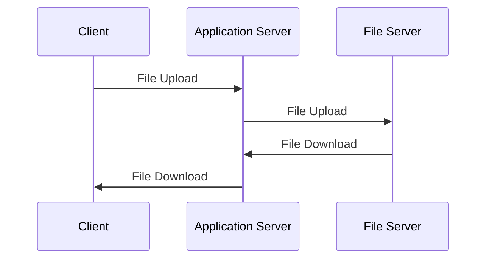
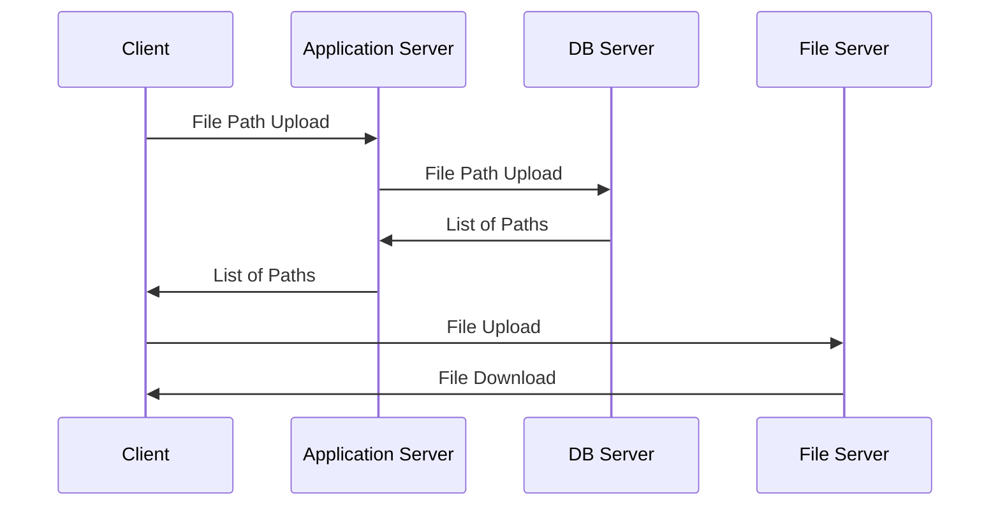

### 파일 저장 방법 2가지
- 파일서버에 파일 저장
- Database에 파일의 내용(BLOB) 저장

- 파일 서버에 파일을 저장했을 때 DB 사용 할 것인가?
```
Client -> Application Server -> File Server
                ||                 ||
            DB Server<-----조회-----|
```
1. Client가 Application Server에 File Upload
2. Application Server에서 DB Server에 File Info 저장(Client는 DB Server에서 목록을 받아서 알 수 있음)
3. Application Server는 File Server에 File 저장

- Bucket 권한 설정
  - 지금은 DB Server를 사용하지 않기 때문에 List 권한 부여
  - Vanilla Script 사용 시 File Server에서 CORS 열어주지 않으면 Application Server에서 받아와야 함, Get 권한 필요
  - 모든 퍼블릭 액세스 비활성화 > 권한 작성 > ACL > CORS 권한 설정
- IAM
  - 사용자 생성 > 직접 정책 설정 > S3FullAccess > 생성
  - 생성한 사용자 클릭 > 보안자격증명 > 액세스 키 만들기 > CLI 또는 AWS 외부에서 접근 클릭 > 생성 > excel 파일다운로드
- Spring
  - Service에 Interface로 모양 설계(메뉴판)
  - Implementation 구현


## 1. S3
### 1)Spring Boot에서 파일 업로드 구현
- 코드가 없는 경우 코드 가져오기
- 토요일 소스 코드: https://github.com/itggangpae/springs3fileupload

- 버킷 생성 및 정보 수정
  - AWS S3 서비스에서 버킷을 생성

  - 버킷의 권한을 설정: 외부에서 버킷에 업로드는 가능하나 다른 작업을 수행 못함

  - 버킷 정책 수정
```json
{
    "Version": "2012-10-17",
    "Statement": [
        {
            "Sid": "PublicListGet",
            "Effect": "Allow",
            "Principal": "*",
            "Action": [
                "s3:List*",
                "s3:Get*",
                "s3:Put*",
                "s3:Delete*"
            ],
            "Resource": [
                "arn:aws:s3:::itstudybucket",
                "arn:aws:s3:::itstudybucket/*"
            ]
        }
    ]
}

```

  - CORS 설정 수정
```json
[
    {
        "AllowedHeaders": [
            "*"
        ],
        "AllowedMethods": [
            "GET",
            "PUT",
            "POST",
            "DELETE"
        ],
        "AllowedOrigins": [
            "*"
        ],
        "ExposeHeaders": [
            "Access-Control-Allow-Origin"
        ]
    }
]
```
- 버킷(AWS의 조작)을 외부에서 사용하기 위한 설정
  - 사용자를 생성하고 권한을 부여한 후 access-key 와 secret-key를 발급받아야 함

- application.properties 파일에 필요한 정보를 설정
```
cloud.aws.credentials.access-key=
cloud.aws.credentials.secret-key=

cloud.aws.s3.bucket=itstudybucket
cloud.aws.region.static=ap-northeast-2
cloud.aws.stack.auto=false

#스프링에서 파일 업로드 할 때 제약 사항
spring.servlet.multipart.max-file-size=20MB
spring.servlet.multipart.max-request-size=20MB
```
- ServiceImpl 클래스 구현

```java {filename="ServiceImpl.java"}
import com.amazonaws.auth.AWSCredentials;
import com.amazonaws.auth.AWSStaticCredentialsProvider;
import com.amazonaws.auth.BasicAWSCredentials;
import com.amazonaws.services.s3.AmazonS3;
import com.amazonaws.services.s3.AmazonS3ClientBuilder;
import com.amazonaws.services.s3.model.CannedAccessControlList;
import com.amazonaws.services.s3.model.ObjectMetadata;
import com.amazonaws.services.s3.model.PutObjectRequest;
import jakarta.annotation.PostConstruct;
import lombok.RequiredArgsConstructor;
import lombok.extern.slf4j.Slf4j;
import org.springframework.beans.factory.annotation.Value;
import org.springframework.stereotype.Service;
import org.springframework.web.multipart.MultipartFile;

import java.io.IOException;
import java.io.InputStream;

@Slf4j
@RequiredArgsConstructor
@Service
public class AwsS3ServiceImpl implements AwsS3Service {
   private AmazonS3 amazonS3Client;

   //properties에서 값을 가지고 와서 설정
   @Value("${cloud.aws.credentials.access-key}")
   private String accessKey;

   @Value("${cloud.aws.credentials.secret-key}")
   private String secretKey;

   @Value("${cloud.aws.s3.bucket}")
   private String bucketName;

   @Value("${cloud.aws.region.static}")
   private String region;

   //생성자가 호출된 후에 수행할 메서드
   @PostConstruct
   public void setS3Client(){
       AWSCredentials credentials = new BasicAWSCredentials(accessKey, secretKey);
       amazonS3Client = AmazonS3ClientBuilder.standard()
               .withCredentials(new AWSStaticCredentialsProvider(credentials))
               .withRegion(region)
               .build();
   }

   //업로드 할 파일 존재 여부를 리턴해주는 메서드
   private boolean validateFileExists(MultipartFile multipartFile) {
       boolean result = true;
       if(multipartFile.isEmpty()){
           result = false;
       }
       return result;
   }

   @Override
   public String uploadFile(String category, MultipartFile multipartFile) {
       boolean result = validateFileExists(multipartFile);
       if(result == false){
           return null;
       }
       //파일 경로 생성
       String fileName = CommonUtils.buildFileName(category, multipartFile.getOriginalFilename());
       //파일 업로드 준비
       ObjectMetadata objectMetadata = new ObjectMetadata();
       objectMetadata.setContentType(multipartFile.getContentType());
       try(InputStream inputStream = multipartFile.getInputStream()){
           amazonS3Client.putObject(new PutObjectRequest(bucketName, fileName, inputStream, objectMetadata)
                   .withCannedAcl(CannedAccessControlList.PublicRead));
       }catch(IOException e){
           return null;
       }
      
       return amazonS3Client.getUrl(bucketName, fileName).toString();
   }
}
```

- Controller 클래스를 생성하고 사용자의 요청을 처리하는 메서드 구현: 
```java {filename="AwsS3Controller.java"}
import lombok.RequiredArgsConstructor;
import org.springframework.web.bind.annotation.PostMapping;
import org.springframework.web.bind.annotation.RequestParam;
import org.springframework.web.bind.annotation.RequestPart;
import org.springframework.web.bind.annotation.RestController;
import org.springframework.web.multipart.MultipartFile;

@RestController
@RequiredArgsConstructor
public class AwsS3Controller {
   //클래스 이름을 적어도 되지만 인터페이스 이름을 기재합니다.
   //인터페이스를 구현하거나 다른 클래스로 상속을 받은 경우
   //상위 타입의 변수에 하위 타입의 인스턴스를 대입할 수 있습니다.
   private final AwsS3Service awsS3Service;

   @PostMapping("/upload")
   public String uploadFile(@RequestParam("category") String category,
                            @RequestPart(value="file")MultipartFile multipartFile){
       return awsS3Service.uploadFile(category, multipartFile);
   }
}
```
- 실행을 해서 에러가 없는지 확인
- Postman API 도구 와 관련된 것을 이용해서 테스트
- 코드에 특별한 문제가 없는데 업로드가 되지 않는 경우
  - S3 버킷에 대한 권한 확인
  - Access Key와 Secret Key 확인

### 2)Spring Boot에서 파일 다운로드 구현
- 다운로드 될 파일의 속성을 설정할 메서드를 CommonUtils에 구현
```java
//다운로드 될 파일의 속성을 설정할 메서드
private static final int UNDER_BAR_INDEX = 1;
public static ContentDisposition createContentDisposition(String categoryWithFileName) {
   String fileName = categoryWithFileName.substring(
           categoryWithFileName.lastIndexOf(CATEGORY_PREFIX) + UNDER_BAR_INDEX);
   return ContentDisposition.builder("attachment")
           .filename(fileName, StandardCharsets.UTF_8)
           .build();
}
```
- Service 인터페이스에 파일 다운로드 메서드 선언
```java
public byte[] downloadFileV1(String resourcePath);
```
- ServiceImpl 클래스에 파일 다운로드 메서드 구현
```java
//경로에 해당하는 파일이 있는지 확인해주는 메서드
private boolean validateFileExistsAtUrl(String resourcePath){
   boolean result = true;
   if(!amazonS3Client.doesObjectExist(bucketName, resourcePath)){
       result = false;
   }
   return result;
}

@Override
public byte[] downloadFileV1(String resourcePath) {
   //경로에 해당하는 자원이 있는지 확인
   boolean result = validateFileExistsAtUrl(resourcePath);
   //없으면 종료
   if(result == false){
       return null;
   }

   S3Object s3Object = amazonS3Client.getObject(bucketName, resourcePath);
   S3ObjectInputStream inputStream = s3Object.getObjectContent();
   try{
       return IOUtils.toByteArray(inputStream);
   }catch (IOException e){
       return null;
   }
}
```
- Controller 클래스에 다운로드를 위한 메서드 추가
```java
//Header를 만들어 주는 메서드
private HttpHeaders buildHeaders(String resourcePath, byte[] data){
   HttpHeaders headers = new org.springframework.http.HttpHeaders();
   headers.setContentLength(data.length);
   headers.setContentType(MediaType.APPLICATION_OCTET_STREAM);
   headers.setContentDisposition(CommonUtils.createContentDisposition(resourcePath));
   return headers;
}

//파일 다운로드 처리 메서드
@GetMapping("/download")
public ResponseEntity<ByteArrayResource> downloadFile(
       @RequestParam("resourcePath") String resourcePath){
   //파일 가져오기
   byte [] data = awsS3Service.downloadFileV1(resourcePath);
   ByteArrayResource resource = new ByteArrayResource(data);
   HttpHeaders headers = buildHeaders(resourcePath, data);
   return ResponseEntity.ok().headers(headers).body(resource);

}
```
- 실행 한 후 브라우저나 Postmap API에서 아래처럼 입력해서 확인   
  http://localhost:8080/download?resourcePath=image/Dockerfile_1732498214300.txt

### 파일 서버 구조
- 대다수의 경우는 클라이언트에서 서버에게 파일을 업로드하고 다시 서버가 파일 서버에 업로드하는 구조를 만드는데 이 경우 트래픽의 낭비가 발생할 수 있음

- 위의 경우 파일 이동 두번하므로 비효율적
- 아래와 같이 클라이언트가 파일 서버에 직업 업로드와 다운로드 하고 DB Server에는 Path만 저장



### 3)react 프로젝트에서 파일 업로드

- react 프로젝트 생성   
`npx create-react-app fileupload`

- 라이브러리 설치   
`npm install aws-sdk`

- App.js 파일에 코드 작성
```js {filename="App.js"}
import React, {useState} from "react";
import AWS from 'aws-sdk'

const S3_BUCKET = 'itstudybucket'
const REGION = 'ap-northeast-2'

AWS.config.update({
  accessKeyId:'액세스ID',
  secretAccessKey: '액세스Key'
});

const myBucket = new AWS.S3({
  params: {Bucket: S3_BUCKET},
  region: REGION
})

function App() {
  //진행 상황 저장을 위한 변수
  const [progress, setProgress] = useState(0);
 
  //파일을 선택했을 때 호출될 이벤트 핸들러
  const handleFileInput = (e) => {
    setSelectedFile(e.target.files[0])
  }

  //실제 업로드 수행할 함수
  const uploadFile = (file) => {
    const params = {
      ACL: 'public-read',
      Body: file,
      Bucket: S3_BUCKET,
      Key: file.name
    }

    myBucket.putObject(params)
    .on('httpUploadProgress', (evt) => {
      setProgress(Math.round((evt.loaded / evt.total) * 100))
    })
    .send((err) => {
      if(err) console.log(err)
    })
  }

  return <div>
    <div>Native SDK File Upload Progress is {progress}%</div>
    <input type="file" onChange={handleFileInput} />
    <button onClick={()=>uploadFile(selectedFile)}>
      Upload To S3
    </button>
    </div>

}

export default App;
```
- 실행: `npm start`

### 4)AWS CLI를 위한 애플리케이션을 설치하고 유저를 추가
- AWS CLI는 로컬 컴퓨터에서 AWS에 명령을 수행하기 위한 도구
- 설치   
  https://docs.aws.amazon.com/ko_kr/cli/latest/userguide/getting-started-install.html
- 확인: `aws --version`

- AWS CLI에서 사용할 계정 설정: `aws configure [--profile 계정명]`

### 5)정적 웹 페이지를 S3에 배포
- 정적 웹 페이지 배포 방법
  - S3 의 속성 중 [정적 웹 사이트 호스팅] 부분을 수정
  - 인덱스 문서의 이름을 설정

- react 프로젝트를 이용해서 웹 페이지를 생성
  - 프롬프트를 react 프로젝트가 있는 곳으로 이동
  - `npm run build` 명령으로 react 프로젝트를 빌드: 정적 웹 사이트를 만들기 위한 명령으로 build 디렉토리에 정적 웹 사이트에 필요한 파일들이 생성됩니다.
  - 업로드: `aws s3 sync ./build s3://버킷이 [--profile=계정명]`
  - `npm run deploy` 명령을 이용해 s3 업로드:
    - package.json 의 scripts에 추가: `"deploy": "aws s3 sync ./build s3://dragonhail"`

### 6)정적 웹 페이지 CI/CD
- react 프로젝트를 git hub에 push
  - aws access key 와 secret key 키가 외부에 노출되면 git hub에 업로드가 안됨   
    이런 경우는 git action의 secret 이나 환경 변수 또는 데이터베이스에 저장해두고 사용을 해야 함
- S3에 자동으로 푸시를 하기 위한 설정
  - .github/workflows/cicd.yaml 파일을 생성하고 작성
```yaml {filename="cicd.yaml"}
name: CI/CD AWS S3

on:
    push:
        branches:
            - main

jobs:
    deploy:
        runs-on: ubuntu-latest
        steps:
            - name: 코드 체크 아웃
              uses: actions/checkout@v3
            - name: AWS IAM 사용자 설정
              uses: aws-actions/configure-aws-credentials@v2
              with:
                aws-access-key-id: ${{ secrets.AWS_ACCESS_KEY_ID }}
                aws-secret-access-key: ${{ secrets.AWS_SECRET_ACCESS_KEY }}
                aws-region: ${{ secrets.AWS_REGION }}
            - name: react build
              run: |
                npm install
                npm run build
                
            - name: S3에 업로드
              run: aws s3 sync build/ s3://${{ secrets.AWS_S3_BUCKET }} --acl public-read
              env:
                AWS_ACCESS_KEY_ID: ${{ secrets.AWS_ACCESS_KEY_ID }}
                AWS_SECRET_ACCESS_KEY: ${{ secrets.AWS_SECRET_ACCESS_KEY }}
```
- GIT HUB Action에 variable 등록
  - AWS_ACCESS_KEY_ID
  - AWS_SECRET_ACCESS_KEY
  - AWS_S3_BUCKET
  - AWS_REGION

- 코드를 푸시해보고 웹 사이트에 변경내용이 반영되는지 확인

### 7)Cloud Front
- 웹 페이지 호스트 와 네트워크 서버 설정을 위한 서비스
- CDN(Content Delivery Network)
  - 리소스 요청이 발생했을 때 사용자가 현재 어디에서 요청하는지에 따라 리소스를 전달해주는 분산 네트워크 시스템
  - 목적은 Edge Location을 통해 사용자에게 최소한의 지연 시간과 최고의 성능으로 콘텐츠를 제공하기 위한 것
  - 최초로 웹사이트 호스팅이 이루어지는 곳을 Origin 이라고 하는데 이 웹사이트는 전 서계에서 다양한 사용자가 방문
  - Origin에서만 서비스를 하게 되면 문제가 발생할 수 있음
  - 멀리 떨어진 곳에서 요청하면 콘텐츠를 받는데 지연 시간이 발생
  - 많은 사용자가 동시 다발적으로 요청하게 되면 지연 시간이 발생
  - 이런 지연 시간 발생을 방지하기 위한 개념 중의 하나가 CDN
  - 많은 요청이 오가는 지역을 근거로 Edge Location을 생성
  - Edge Location은 Origin Server에서 가지고 있는 컨텐츠 복사본을 가지고 있으며 컨텐츠 요청을 전달받을 때 Origin Server에서 컨텐츠를 전달하는 것이 아니고 사용자와 가장 가까운 Edge Location에서 컨텐츠를 전송하는 것
  - S3를 단독으로 사용하면 정적 웹 사이트 배포가 가능하지만 CDN을 제공하는 Cloud Front를 이용하면 동적 웹 사이트 호스팅도 가능
- CloudFront를 사용하게 되면 Cache 기능을 이용하기 때문에 CI/CD 적용이 바로 안되는 경우가 있기 때문에 이 때는 Cache를 무력화 시키는 부분에 대해 생각을 해야 함
- 캐시 무력화 정책
  - Git Hub Action 을 위한 yaml 파일에 코드를 추가
  ```yaml
              - name: 캐시-무력화
              uses: chetan/invalidate-cloudfront-action@v2
              env:
                DISTRIBUTION: ${{ secrets.AWS_CLOUDFRONT_ID }}
                PATHS: "/*"
                AWS_REGION: ap-northeast-2
                AWS_ACCESS_KEY_ID: ${{ secrets.AWS_ACCESS_KEY_ID }}
                AWS_SECRET_ACCESS_KEY: ${{ secrets.AWS_SECRET_ACCESS_KEY }}
  ```
  - AWS_CLOUDFRONT_ID 키를 Git Hub에 추가
  - IAM에서 사용자에게 CLOUDFRONT 설정 권한을 추가

### 8)HTTPS 인증서
- https는 http 보안이 추가된 프로토콜
- 인증서 생성
  - AWS Certificate Manager 서비스에 접속해서 인증서 요청 > Public 인증서 요청 > 도메인 작성 > 생성
  - route 53에서 레코드 생성 클릭
  - Cloud Front에서 배포 생성 > Origin S3 선택 > 웹사이트 엔드포인트 > Custom SSL Certificate에서 인증서 선택

  - route 53에서 도메인 등록 후 레코드 생성 > 트래픽 라우팅 대상 S3 엔드포인트 선택